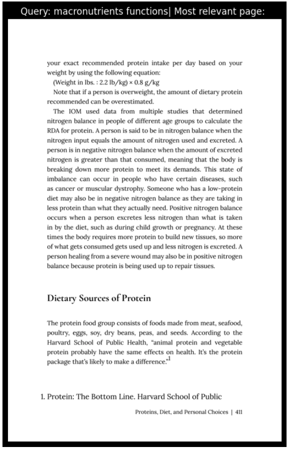
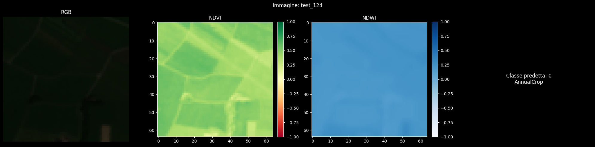
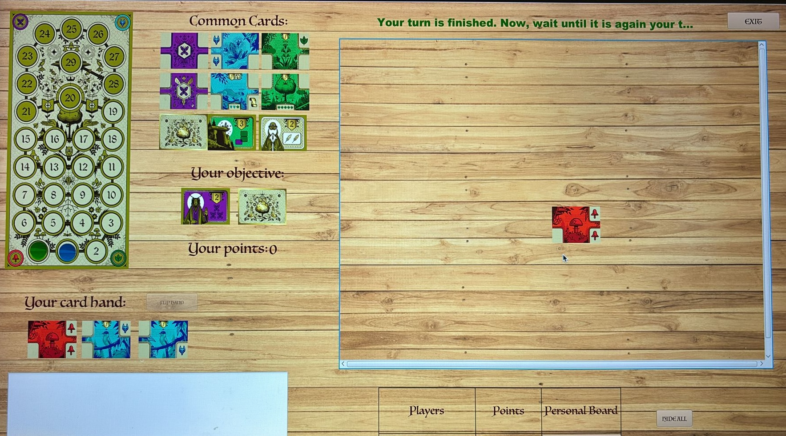
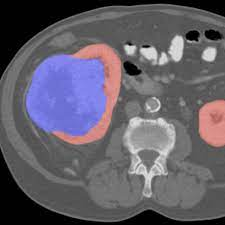
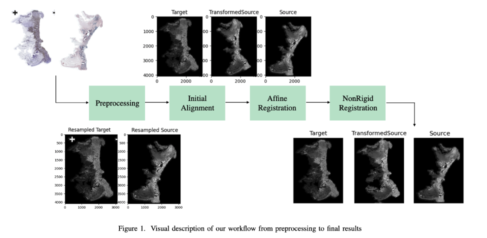

### Hi, I'm Lorenzo Sciarretta 👋  
I'm a Master's student in Computer Science at the **University of St. Gallen** and **ETH Zurich**.  

I have a strong technical foundation with expertise in **machine learning**, **deep learning**, and **software engineering**. Currently, I am conducting research on [**Weight Space Learning**](https://weight-space-learning.github.io/) at the **AI/ML Lab** at HSG with [**Prof. Damian Borth**](https://de.wikipedia.org/wiki/Damian_Borth).  

Previously, I worked as a **Research Assistant** at the **ETH AI Center**, under the supervision of [**Prof. Shih-Chii Liu**](https://en.wikipedia.org/wiki/Shih-Chii_Liu), and as a **Quantitative Researcher** at the **Financial Econometrics Chair** (Math & Statistics Department), under the supervision of [**Prof. M.R. Fengler**](https://sites.google.com/site/mrfengler02/).  

Complementing my technical background, my education at HSG has provided me with a solid understanding of **business and strategic management**, enabling me to bridge the gap between **technical innovation** and **organizational objectives**.

---
## 🚀 Projects

  

    

        <h3>NeuNetCNN - lightweight CNN for semantic segmentation</h3>
        <!-- 
        
A very simple Retrieval-Augmented Generation (RAG) system running locally, integrating vector search and prompt chaining for document-based question answering.

        

            LangChain,
            Python,
            LLM, gemma
        

        <a href="https://github.com/L-Neur0/Simple-Local-RAG" class="project-link" target="_blank">View Code</a> -->
    

  

  

    

        <h3>Simple Local RAG</h3>
        
        
A very simple Retrieval-Augmented Generation (RAG) system running locally, integrating vector search and prompt chaining for document-based question answering.

        

            LangChain,
            Python,
            LLM, gemma
        

        <a href="https://github.com/L-Neur0/Simple-Local-RAG" class="project-link" target="_blank">View Code</a>
    

  

  

    

        <h3>EUROSAT Image Classification</h3>
        
        
Land use classification using multispectral data. Combines advanced data augmentations, attention-based deep learning, and ensemble methods for robust accuracy.

        

            Deep Learning,
            CV,
            Attention mechanism
        

        <a href="https://github.com/L-Neur0/EUROSAT-satellite_image-classification" class="project-link" target="_blank">View Code</a>
    

  

  

    

        <h3>Job Broker System</h3>
        
An auction-based job assignment system using hexagonal architecture. Features job scheduling, worker credit systems, and fault tolerance.

        

            Microservices
            Distributed Systems
            Java
        

        <a href="https://github.com/L-Neur0/Pitas---Job-Broker-Application" class="project-link" target="_blank">View Code</a>
    

  

  

    

        <h3>CODEX Naturalis App</h3>
        
        
Full-stack Java application simulating a board game. Built the network layer (RMI and Socket), game logic, and created TUI and GUI interfaces.

        

            Java
            Networking
            GUI/TUI
        

        <a href="https://github.com/L-Neur0/Software-Engineering-Final-Project" class="project-link" target="_blank">View Code</a>
    

  

  

    

        <h3>Kidney Tumor Segmentation</h3>
        
        
Biomedical CV research at NECSTLab. Developed software for Kidney and Tumor segmentation using Deep Learning (CNNs) on NIFTI images.

        

            Biomedical CV
            Deep Learning
            Segmentation
        

        <a href="https://github.com/L-Neur0/Kits19_BCV_Lorenzo_Sciarretta/tree/main" class="project-link" target="_blank">View Code</a>
    

  

  
  

    

        <h3>Histology Registration</h3>
        
        
Implementation of an Unsupervised Deep Learning Registration Framework for Histology Samples with Varied Staining.

        

            Research Paper
            Deep Learning
            Unsupervised
        

        <a href="https://github.com/L-Neur0/Implementation-of-an-Unsupervised-Deep-Learning-Registration-Framework-for-Histology-Samples/blob/main/Paper.pdf" class="project-link" target="_blank">Read Paper</a>
    

  

---

## Skills

  <ul>
    <li>LLMs: prompting, fine-tuning, security & reliability, architecture optimization, efficient attention mechanisms</li>
    <li>Machine Learning: DFM, SVM, ... (Python, R) Scikit-learn, pandas, Numpy)</li>
    <li>Time-Series Forecasting (Python, R, Julia)</li>
    <li>Deep Learning: LSTM, RNN, NN, Computer Vision, PCA (TensorFlow, PyTorch, Nibabel)</li>
    <li>Strategic Management and Business Integration</li>
    <li>Software Engineering (Java, C)</li>
    <li>Data Visualization (Matplotlib, Plotly, ggplot2, latex, Tableau)</li>
    <li>Databases (SQL, snowlflake)</li>
  </ul>

