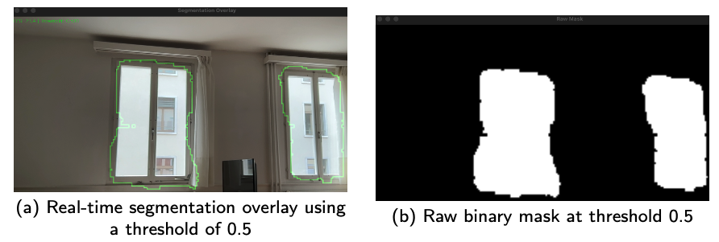
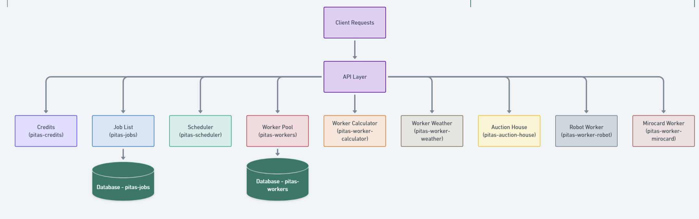

  
  Actively researching · Multi-LLM Agent Systems @ DISCO Lab

### Hi, I'm Lorenzo Sciarretta

AI/ML researcher and engineer, currently completing my Master's in Computer Science at **ETH Zurich** and the **University of St. Gallen**.

I am currently doing research on **Multi-LLM agent systems** together with the **ETH Zurich** [**DISCO Lab**](https://disco.ethz.ch/) — studying how multiple large language models can collaborate, coordinate, and reason together.

Previously: **Weight Space Learning** at the **AI/ML Lab at HSG** with [Prof. Damian Borth](https://de.wikipedia.org/wiki/Damian_Borth) (hyper-representations across neural network collections), **Research Assistant** at the **ETH AI Center** with [Prof. Shih-Chii Liu](https://en.wikipedia.org/wiki/Shih-Chii_Liu) (neuromorphic/edge ML), and **Quantitative Researcher** at the **Financial Econometrics Chair** with [Prof. M.R. Fengler](https://sites.google.com/site/mrfengler02/).

---

  
Current Research

  <h3>Multi-LLM Agent Systems</h3>
  
Researching how multiple large language models can collaborate, coordinate, and reason together as part of structured multi-agent systems — together with the <a href="https://disco.ethz.ch/">ETH Zurich DISCO Lab</a>.

  

    Multi-Agent Systems
    LLM Agents
    Coordination
    Reasoning
    Large Language Models
  

  <h2>Projects</h2>
  

  

    <video
      controls
      preload="metadata"
      poster="assets/images/sane_moe.png"
      class="project-image">
      <source src="assets/IMP_final_video.mp4" type="video/mp4">
      Your browser does not support the video tag.
    </video>
    

        <h3>SANE-MoE: Weight-Space Learning</h3>
        
Mixture-of-Experts extension for Transformer-based weight space autoencoders. Enables robust hyper-representations across heterogeneous neural network collections, overcoming interference in diverse model sets.

        

            Deep Learning
            Weight-Space
            Mixture-of-Experts
            Transformer
        

        <a href="assets/IMP_final_version.pdf" class="project-link" target="_blank">Read Paper</a>
    

  

  

    
    

        <h3>NeuNetCNN — Lightweight CNN for BMI</h3>
        
Brain-Machine Interface research at ETH AI Center / INI. Lightweight CNN for semantic segmentation optimised for edge deployment on neuromorphic hardware.

        

            Deep Learning
            CNN
            Edge ML
        

        Under NDA
    

  

  

    
    

        <h3>Simple Local RAG</h3>
        
Retrieval-Augmented Generation system running fully locally — vector search, prompt chaining, and document-based QA with open-weight LLMs.

        

            LangChain
            LLM
            RAG
            Gemma
        

        <a href="https://github.com/L-Neur0/Simple-Local-RAG" class="project-link" target="_blank">View Code</a>
    

  

  

    
    

        <h3>EUROSAT Image Classification</h3>
        
Land-use classification from multispectral satellite imagery using attention-based deep learning, advanced augmentations, and ensemble methods.

        

            Computer Vision
            Attention
            Ensemble
        

        <a href="https://github.com/L-Neur0/EUROSAT-satellite_image-classification" class="project-link" target="_blank">View Code</a>
    

  

  

    
    

        <h3>Job Broker System</h3>
        
Auction-based distributed job assignment system using hexagonal architecture with worker credit systems and fault tolerance.

        

            Microservices
            Distributed Systems
            Java
        

        <a href="https://github.com/L-Neur0/Pitas---Job-Broker-Application" class="project-link" target="_blank">View Code</a>
    

  

  

    
    

        <h3>Kidney Tumor Segmentation</h3>
        
Biomedical CV research at NECSTLab. Deep learning pipelines (CNNs) for kidney and tumor segmentation on volumetric NIFTI images.

        

            Biomedical CV
            Segmentation
            PyTorch
        

        <a href="https://github.com/L-Neur0/Kits19_BCV_Lorenzo_Sciarretta/tree/main" class="project-link" target="_blank">View Code</a>
    

  

  

    
    

        <h3>Histology Registration</h3>
        
Unsupervised deep learning registration framework for histology samples with varied staining — deformable registration without labelled pairs.

        

            Research Paper
            Unsupervised
            Medical Imaging
        

        <a href="https://github.com/L-Neur0/Implementation-of-an-Unsupervised-Deep-Learning-Registration-Framework-for-Histology-Samples/blob/main/Paper.pdf" class="project-link" target="_blank">Read Paper</a>
    

  

  

    
    

        <h3>CODEX Naturalis App</h3>
        
Full-stack Java board game simulation. Built the network layer (RMI and Socket), game logic engine, and TUI/GUI interfaces.

        

            Java
            Networking
            GUI/TUI
        

        <a href="https://github.com/L-Neur0/Software-Engineering-Final-Project" class="project-link" target="_blank">View Code</a>
    

  

  <h2>Skills</h2>
  

  

    <h4>Deep Learning</h4>
    

      PyTorch
      TensorFlow
      Transformers
      CNNs
      RNNs / LSTMs
      MoE
    

  

  

    <h4>LLMs & GenAI</h4>
    

      Fine-tuning
      RAG
      Prompt Engineering
      LangChain
      Efficient Attention
    

  

  

    <h4>Machine Learning</h4>
    

      scikit-learn
      SVM
      Ensemble Methods
      Time-Series
      Bayesian Methods
    

  

  

    <h4>Computer Vision</h4>
    

      Segmentation
      Classification
      Medical Imaging
      Nibabel
    

  

  

    <h4>Languages</h4>
    

      Python
      Java
      R
      Julia
      C
      SQL
    

  

  

    <h4>Tools & Infra</h4>
    

      Git
      Pandas / NumPy
      Plotly
      LaTeX
      Snowflake
      Tableau
    

  

