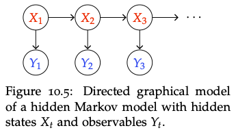

  
RL Notes · Chapter 3 · Foundations

  <h1>Hidden Markov Models</h1>
  
Hidden states, observable emissions, and the link to POMDPs.

**Contents**
* TOC
{:toc}

A *Hidden Markov Model* (HMM) is a Markovian process with **unobservable** states $X_t$ and observations $Y_t$ that depend on $X_t$ in a known way.

  <a class="post-nav-prev" href="./rl_pomdp">POMDPs</a>
  <a class="post-nav-next" href="./rl_tabular">Reinforcement Learning — Tabular</a>

