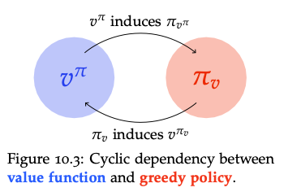

  
RL Notes · Chapter 1 · Foundations

  <h1>Markov Decision Processes</h1>
  
Formal model for sequential decision making under uncertainty.

**Contents**
* TOC
{:toc}

A Markov Decision Process (MDP) is a mathematical model for sequential decision making under uncertainty.

The formal definition of a **finite MDP** is:

Definition · Finite MDP

A *finite MDP* is specified by:
1. a finite set of states $X$;
2. a finite set of actions $A$;
3. an initial state distribution $P_0$;
4. *transition probabilities* $P(x' \mid x, a)$;
5. a *reward function* $r(x, a)$.

In the MDP setting we assume that we know $P$ and $r$, which is why we say it is a **known environment**, fully observable.

**Goal:** learn how the agent should behave to optimize its reward. How do we optimally decide what the next action is? This decision map is called a *policy*:

Definition · Policy

A *policy* is a function that maps each state $x \in X$ of the MDP to a probability distribution over the actions:

$$
\pi(a \mid x) = P(A_t = a \mid X_t = x), \quad t \geq 0.
$$

For MDPs, optimal policies can always be taken to be deterministic. Interestingly, a *policy* induces a **Markov Chain** $\{X^{\pi}_t\}_{t \in \mathbb{N}_0}$ with transition probabilities:

$$
p^{(\pi)}(x' \mid x) = P(X^{\pi}_{t+1} = x' \mid X^{\pi}_{t} = x) = \sum_{a \in A} \pi(a \mid x)\, p(x' \mid x, a).
$$

So if the agent follows a fixed policy, the evolution of the process is described entirely by a Markov Chain.

But, as mentioned above, the goal is to maximise the reward — how do we do that? There are many ways. If we know the MDP (we can evaluate it for all $a, x'$), a very common choice is the *discounted payoff*. We want to maximise $\mathbb{E}\!\left[\sum_{t=0}^{T-1} r(x_t, a_t)\right]$, discounted by a factor $\gamma \in [0, 1)$, the *discount factor*. The discounted payoff from time $t$ is the random variable

$$
G_t = \sum_{m=0}^{\infty} \gamma^{m} R_{t+m},
$$

also called the **infinite-horizon discounted reward**.

Now we want to understand the effect of the initial state and initial action on the optimisation objective $G_t$. To do so we use two functions:

1. **State-value function**: expected return starting in $x$ and following $\pi$: $v^{\pi}_t(x) = \mathbb{E}_{\pi}[G_t \mid X_t = x]$.
2. **State–action value function**: expected return starting in $x$, taking action $a$, then following $\pi$: $q^{\pi}_t(x, a) = \mathbb{E}_{\pi}[G_t \mid X_t = x, A_t = a]$.

Above we considered deterministic policies; for a *randomised policy* we have $\pi : X \to \Delta(A)$, mapping states to distributions over actions.

## Computing the value of a policy: Bellman expectation equation

A policy is associated with its *value function*. How do we compute it? Recall:

$$
J(\pi) = \mathbb{E}\!\left[r(x_0, \pi(x_0)) + \gamma\, r(x_1, \pi(x_1)) + \gamma^2 r(x_2, \pi(x_2)) + \cdots\right].
$$

Then

$$
\begin{aligned}
V^{\pi}(x) &= J(\pi \mid X_0 = x) \\
          &= \mathbb{E}\!\left[\sum_{t=0}^{\infty} \gamma^t r(x_t, \pi(x_t)) \,\Big|\, X_0 = x\right] \\
          &= r(x, \pi(x)) + \gamma \sum_{x'} p(x' \mid x, \pi(x))\, V^{\pi}(x').
\end{aligned}
$$

This is the **Bellman expectation equation**, and it shows the recursive dependence of the value function on itself: the value of the current state equals the immediate reward plus a discounted sum of all future rewards from subsequent states.

In vector form:

$$
V^{\pi} = (I - \gamma P^{\pi})^{-1} r^{\pi}.
$$

This is a linear system, and solving it directly involves matrix inversion, which is cubic in time. There are faster ways:

### Fixed-point iteration

Obtain an (approximate) solution to $V^{\pi}$.

*See notes and proof.*

## Policy optimization

Recall that our goal was to find an optimal policy:

$$
\pi^{*} = \operatorname{argmax}_{\pi}\, \mathbb{E}_{\pi}[G_0].
$$

We can alternatively characterise an optimal policy via

$$
\pi \geq \pi' \iff v^{\pi}(x) \geq v^{\pi'}(x), \quad \forall x \in X.
$$

It follows that all optimal policies have **identical** value functions; we write $v^{*} = v^{\pi^{*}}$ and $q^{*} = q^{\pi^{*}}$ for the value and action-value functions of an optimal policy. Then

$$
v^{*}(x) = \max_{\pi}\, v^{\pi}(x), \qquad q^{*}(x, a) = \max_{\pi}\, q^{\pi}(x, a).
$$

We define the *<mark>greedy policy</mark>* with respect to a state–action value function as

$$
\pi_q(x) = \operatorname{argmax}_{a \in A}\, q(x, a).
$$

## Bellman optimality equation

Following the *greedy policy* $\pi_v$ leads to a new value function $v^{\pi_{v}}$. The correspondence between greedy policies and value functions induces a cyclic dependency:

It turns out that the optimal policy $\pi^{*}$ is a fixed point of this dependency. Hence:

Theorem · Bellman

A policy $\pi^{*}$ is optimal iff it is greedy with respect to its own value function. Equivalently, $\pi^{*}$ is optimal iff $\pi^{*}(x)$ is a distribution over $\operatorname{argmax}_{a \in A} q^{*}(x, a)$.

Corollary

The optimal value function $v^{*}$ is a fixed point of the *Bellman update*:

$$
v^{*}(x) = \max_{a \in A} \big[\, r(x, a) + \gamma\, \mathbb{E}_{x' \mid x, a}[\, v^{*}(x')\, ]\, \big].
$$

### Policy iteration

*See notes.* Using the above we can converge faster than fixed-point iteration.

### Value iteration

  
  <a class="post-nav-next" href="./rl_pomdp">POMDPs</a>

