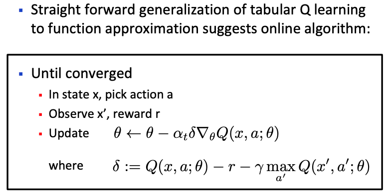
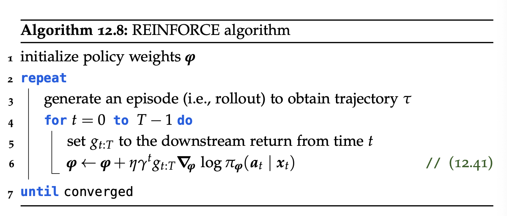
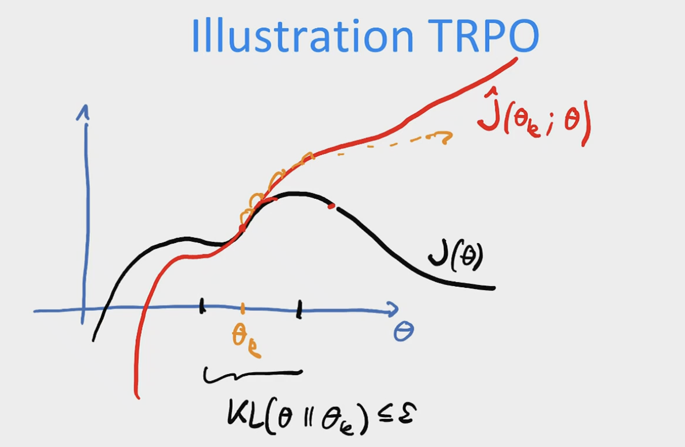
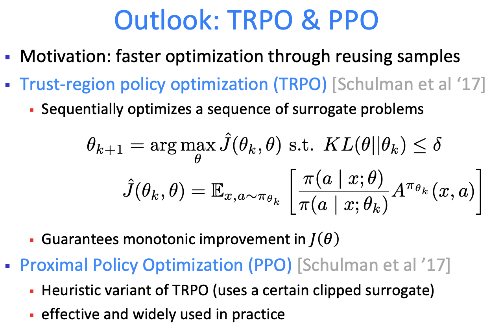
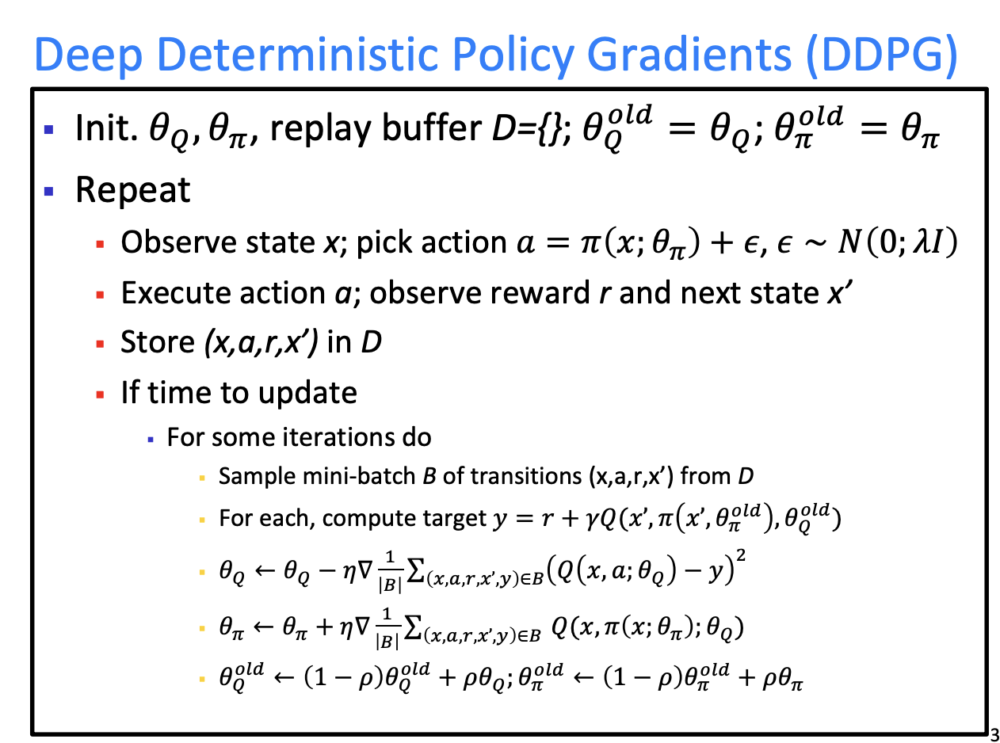

  
RL Notes · Chapter 5 · Approximate

  <h1>Reinforcement Learning with Function Approximation</h1>
  
From tabular RL to large state–action spaces: value approximation, policy gradients, actor-critic, and entropy-regularised RL.

**Contents**
* TOC
{:toc}

We have seen on-policy and off-policy RL algorithms, but there is a problem: tabular MDP / RL methods are polynomial in the number of actions $\lvert A \rvert$ and states $\lvert X \rvert$. The goal now is to scale from simple tabular RL to large $\lvert A \rvert$ and $\lvert X \rvert$. To do so, we need to extend *model-free methods* such as TD-learning and Q-learning to large state and action spaces.

The only way to do this is to learn **approximations** of value functions (through regression).

The first step is to recast tabular RL as an *optimisation* problem.

# 1. Tabular RL as an optimisation problem

We re-interpret the model-free methods from the previous chapter — TD- and Q-learning — as optimisation problems where each iteration is a single gradient update.

Consider TD-learning:

$$
V^{\pi}(x) \leftarrow (1 - \alpha_t)\, V^{\pi}(x) + \alpha_t\!\left(r + \gamma\, V^{\pi}(x')\right).
$$

This is the update rule of an optimisation algorithm. We just have to parametrise the estimate of $V^{\pi}$ with parameters $\theta$ and update them according to the gradient of some loss. In a finite domain (e.g. tabular), we can parametrise the value function with a separate parameter for each state:

$$
V^{\pi}(x; \theta) = \theta(x).
$$

To re-derive the $V^{\pi}$ update as a gradient update we need a loss function. Consider

$$
\bar{\ell}(\theta; x, r) = \tfrac{1}{2}\big(v^{\pi}(x) - \theta(x)\big)^2,
$$

and using the Bellman equation,

$$
\bar{\ell}(\theta; x, r) = \tfrac{1}{2}\!\left(r + \gamma\, \mathbb{E}_{x' \mid x, \pi(x)}[v^{\pi}(x')] - \theta(x)\right)^2,
$$

which is the classical squared loss between the parameter and the target label $v^{\pi}$. Now we can view TD-learning as SGD. The first issue is that we cannot compute the expectation, so as in TD-learning we use a bootstrapped estimate of $V^{\pi}$. This bootstrapped estimate is treated as if it were independent of the current $\theta$:

$$
V^{\pi}(x; \theta_{\text{old}}) \approx v^{\pi}(x),
$$

where $\theta_{\text{old}} = \theta$ but is treated as a constant w.r.t. $\theta$. **Bootstrapping** thus means using "old" value estimates as labels.

Secondly, the expectation is over the transition model — which we are trying to avoid in model-free methods — so we use a Monte Carlo estimate from a single sample. This is only possible because transitions are conditionally independent given the state–action pair.

Using these shortcuts, the loss becomes

$$
\ell(\theta; x, r, x') = \tfrac{1}{2}\!\left(r + \gamma\, \theta^{\text{old}}(x') - \theta(x)\right)^2,
$$

with gradient w.r.t. $\theta(x)$:

$$
\delta_{\text{TD}} \coloneqq \nabla_{\theta(x)}\, \ell(\theta; x, r, x') = \theta(x) - \big(r + \gamma\, \theta^{\text{old}}(x')\big).
$$

This is the **temporal-difference (TD) error**: it compares the previous estimate of the value function to the bootstrapped one.

---

# Model free
## 2. Value function approximation

Now that we have the value-function update as a gradient step, it is natural to find an approximation of the parametrised $V(x; \theta)$ or $Q(x, a; \theta)$ to scale to large settings. Think of this as a regression problem mapping state(–action) pairs to a real number. This is a strict generalisation of the tabular setting, where we used a separate parameter per state–action pair.

For large state–action spaces, we exploit smoothness (the value function takes similar values in similar states) to compress the representation. An easy way to do this is **linear function approximation**, e.g. for $Q$:

$$
\hat{Q}^{*}(x, a; \theta) = \theta^{\top} \phi(x, a),
$$

where $\phi$ is a hand-designed feature map. (A common alternative is to use a NN to learn these features — *deep reinforcement learning*.)

After observing a transition $(x, a, r, x')$, the gradient update (analogous to the one for $V$) uses

$$
\ell(\theta; x, a, r, x') \coloneqq \tfrac{1}{2}\!\left(r + \gamma \max_{a' \in \mathcal{A}} Q^{*}(x', a'; \theta^{\text{old}}) - Q^{*}(x, a; \theta)\right)^2.
$$

The difference between the current approximation and the optimisation target,

$$
\delta_{\mathrm{B}} \coloneqq r + \gamma \max_{a' \in \mathcal{A}} Q^{*}(x', a'; \theta^{\text{old}}) - Q^{*}(x, a; \theta),
$$

is called the *Bellman error*. Analogously to TD-learning, we obtain the gradient update

$$
\theta \leftarrow \theta - \alpha_t\, \nabla_{\theta} \ell(\theta; x, a, r, x') = \theta + \alpha_t\, \delta_{\mathrm{B}}\, \nabla_{\theta} Q^{*}(x, a; \theta),
$$

and in the *linear case*

$$
\nabla_{\theta} \ell = -\delta_{\mathrm{B}} \cdot \phi(x, a).
$$

But this algorithm is rather slow!

---

## 3. Neural Fitted Q-iteration / DQN

To accelerate Q-learning with (neural) function approximation:
- use "experience replay" — maintain a dataset $D$ of observed transitions;
- clone the network to keep "target" values constant across episodes (the cloned network is the target network $Q(x', a'; \theta^{\text{old}})$).

The loss is then

$$
L(\theta) = \sum_{(x, a, r, x')}\!\left(r + \gamma\, \max_{a'} Q(x', a'; \theta^{\text{old}}) - Q(x, a; \theta)\right)^2.
$$

How exactly this is implemented varies.

#### Increasing stability — Double DQN

Standard DQN suffers from **maximisation bias**: since we max over $Q$, which is itself an estimate, we can get over-estimates. The idea is to split the max: Double DQN uses the *current* network to evaluate the argmax (action selection), then evaluates that action with the *cloned target* network:

$$
\mathcal{L}_{\text{DDQN}}(\theta) = \sum_{(x, a, r, x') \in \mathcal{D}}\!\left(r + \gamma\, Q\!\left(x', a^{*}(\theta); \theta^{\text{old}}\right) - Q(x, a; \theta)\right)^2,
$$

where

$$
a^{*}(\theta) = \operatorname*{argmax}_{a'} Q(x', a'; \theta).
$$

The fundamental idea of Q-learning is that it chooses the next action by implicitly defining a policy via

$$
a_t = \operatorname*{argmax}_a Q(x_t, a; \theta),
$$

but this is **intractable** for large or continuous action spaces.

---

## 4. Policy search methods

Learn a parametrised policy (actor): $\pi(x) = \pi_{\theta}(x) = \pi(x; \theta)$. For episodic tasks (when the agent can be reset), expected rewards can be computed by "rollouts" (Monte Carlo forward sampling — on-policy). The idea is to find optimal parameters via global optimisation:

$$
\theta^{*} = \operatorname*{argmax}_{\theta}\, \hat{J}_T(\theta).
$$

### 4.1 Policy gradients

The objective is to maximise

$$
J(\theta) = \mathbb{E}_{x_{0:T},\, a_{0:T} \sim \pi_{\theta}}\!\left[\sum_{t = 0}^{T} \gamma^t r(x_t, a_t)\right] = \mathbb{E}_{\tau \sim \pi_{\theta}}[r(\tau)].
$$

How do we obtain gradients w.r.t. $\theta$?

Theorem · Score-function gradient

$$
\nabla J(\theta) = \nabla\, \mathbb{E}_{\tau \sim \pi_{\theta}}[r(\tau)] = \mathbb{E}_{\tau \sim \pi_{\theta}}\!\left[r(\tau)\, \nabla \log \pi_{\theta}(\tau)\right].
$$

**Proof.** Recall

$$
\nabla_{\theta} \log \pi_{\theta}(\tau) = \frac{\nabla_{\theta} \pi_{\theta}(\tau)}{\pi_{\theta}(\tau)}.
$$

Then

$$
\nabla\, \mathbb{E}_{\tau \sim \pi_{\theta}} r(\tau) = \nabla \int \pi_{\theta}(\tau)\, r(\tau)\, d\tau = \int \big(\nabla \pi_{\theta}(\tau)\big)\, r(\tau)\, d\tau
$$

$$
= \int \pi_{\theta}(\tau)\, \nabla \log \pi_{\theta}(\tau)\, r(\tau)\, d\tau = \mathbb{E}_{\tau \sim \pi_{\theta}}\!\left[r(\tau)\, \nabla \log \pi_{\theta}(\tau)\right]. \;\square
$$

**Exploiting the MDP structure.** To obtain gradients of $J(\theta)$ we need to compute

$$
\mathbb{E}_{\tau \sim \pi_{\theta}}\!\left[r(\tau)\, \nabla \log \pi_{\theta}(\tau)\right].
$$

From the MDP, $r(\tau) = \sum_{t=0}^{T} \gamma^t r(x_t, a_t)$, and the trajectory distribution factorises as

$$
\pi_{\theta}(\tau) = p(x_0) \prod_{t=0}^{T} \pi(a_t \mid x_t; \theta)\, p(x_{t+1} \mid x_t, a_t).
$$

Taking the gradient of the log-probability,

$$
\nabla_{\theta} \log \pi_{\theta}(\tau) = \nabla_{\theta}\!\left(\log p(x_0) + \sum_{t=0}^{T} \log \pi(a_t \mid x_t; \theta) + \sum_{t=0}^{T} \log p(x_{t+1} \mid x_t, a_t)\right).
$$

Since the dynamics and initial-state distribution do not depend on $\theta$, $\nabla_{\theta} \log p(x_0) = 0$ and $\nabla_{\theta} \log p(x_{t+1} \mid x_t, a_t) = 0$. Therefore

$$
\nabla_{\theta} \log \pi_{\theta}(\tau) = \sum_{t=0}^{T} \nabla_{\theta} \log \pi(a_t \mid x_t; \theta).
$$

Thus

$$
\mathbb{E}_{\tau \sim \pi_{\theta}}\!\left[r(\tau)\, \nabla \log \pi_{\theta}(\tau)\right] = \mathbb{E}_{\tau \sim \pi_{\theta}}\!\left[r(\tau) \sum_{t=0}^{T} \nabla \log \pi(a_t \mid x_t; \theta)\right].
$$

Although these gradients are unbiased, they have **very large variance**. We can reduce this variance using *baselines*.

Lemma · Baseline subtraction

$$
\mathbb{E}_{\tau \sim \pi_{\theta}}\!\left[r(\tau)\, \nabla \log \pi_{\theta}(\tau)\right] = \mathbb{E}_{\tau \sim \pi_{\theta}}\!\left[(r(\tau) - b)\, \nabla \log \pi_{\theta}(\tau)\right].
$$

**Proof.** It suffices to show $\mathbb{E}_{\tau \sim \pi_{\theta}}[b\, \nabla \log \pi_{\theta}(\tau)] = 0$. Using $\nabla_{\theta} \log \pi_{\theta}(\tau) = \nabla_{\theta} \pi_{\theta}(\tau) / \pi_{\theta}(\tau)$,

$$
\mathbb{E}_{\tau \sim \pi_{\theta}}[b\, \nabla \log \pi_{\theta}(\tau)] = b \int \pi_{\theta}(\tau)\, \frac{\nabla_{\theta} \pi_{\theta}(\tau)}{\pi_{\theta}(\tau)}\, d\tau = b\, \nabla_{\theta} \int \pi_{\theta}(\tau)\, d\tau = b\, \nabla_{\theta} 1 = 0. \;\square
$$

**Example: baseline = downstream return.** A state-dependent baseline:

$$
b(\tau_{0:t-1}) = \sum_{m=0}^{t-1} \gamma^m r_m.
$$

<mark>This baseline subtracts the returns of all actions before time $t$.</mark> Intuitively, the score gradient then only considers downstream returns. We obtain the estimator

$$
\nabla J(\theta) = \mathbb{E}_{\tau \sim \pi}\!\left[\sum_{t=0}^{T} \gamma^t G_t\, \nabla \log \pi(a_t \mid x_t; \theta)\right],
$$

where $G_t$ is the (bounded) discounted payoff from time $t$: <mark>the reward-to-go</mark> following action $a_t$. Also called the (bounded) downstream return:

$$
G_t = \sum_{t' = t}^{T} \gamma^{t' - t} r_{t'}.
$$

Performing SGD with the score gradient and downstream returns is the **REINFORCE** algorithm (Williams, 1992):

(Initialise the policy parameters, set $G_t$ to the return from step $t$, and update.)

The variance of REINFORCE can be reduced further. The basic estimate is

$$
\nabla_{\theta} J(\theta) = \mathbb{E}_{\tau \sim \pi_{\theta}}\!\left[\sum_{t=0}^{T} \gamma^t\, G_t\, \nabla \log \pi(a_t \mid x_t; \theta)\right].
$$

A common variance-reduction trick is a stronger baseline $b_t$:

$$
\nabla_{\theta} J(\theta) = \mathbb{E}_{\tau \sim \pi_{\theta}}\!\left[\sum_{t=0}^{T} \gamma^t\, (G_t - b_t(x_t))\, \nabla \log \pi(a_t \mid x_t; \theta)\right].
$$

One example is the **mean over returns**:

$$
b_t(x_t) \doteq b = \frac{1}{T} \sum_{t' = 0}^{T} G_{t'}.
$$

**Remark.** The big advantage of policy-gradient methods is that they work in continuous action spaces. However, REINFORCE is not guaranteed to find an optimal policy — even in very small domains it can get stuck in local optima.

Next, we combine value approximation (Q-learning) and policy gradient methods, leading to the more practical family of **actor–critic** methods.

---

## 5. On-policy: actor–critic methods

Actor–critic methods reduce the variance of policy-gradient estimates by using ideas from value-function approximation.

**Idea:** use function approximation both for value functions and for policies.

Definition · Advantage function

Given a policy $\pi$, the *advantage function* is

$$
A^{\pi}(x, a) \doteq q^{\pi}(x, a) - \underbrace{v^{\pi}(x)}_{= \mathbb{E}_{a \sim \pi(\cdot \mid x)}[Q^{\pi}(x, a)]}.
$$

It measures the advantage of picking action $a \in \mathcal{A}$ in state $x \in \mathcal{X}$ over simply following $\pi$.

It has an important property — for the greedy action,

$$
\forall \pi, x: \quad \max_a A^{\pi}(x, a) \geq 0.
$$

The Bellman optimality principle is essentially: the max is always at least the average — *a policy is optimal iff there is no advantage in any state*:

$$
\pi \text{ optimal} \iff \forall x, a:\; A^{\pi}(x, a) \leq 0.
$$

The greedy policy can be re-stated as $\pi_G(x) = \operatorname*{argmax}_a Q^{\pi}(x, a) = \operatorname*{argmax}_a A^{\pi}(x, a)$.

We have already seen how to estimate the value function; below we will see we can also estimate it *off-policy*.

### 5.1 Policy Gradient Theorem

Recall from §4.1 how to compute policy gradients with the canonical MC-based score-function trick (REINFORCE). We derived

$$
\nabla J(\theta) = \mathbb{E}_{\tau \sim \pi}\!\left[\sum_{t=0}^{T} \gamma^t G_t\, \nabla \log \pi(a_t \mid x_t; \theta)\right].
$$

As mentioned, this is slow, so we try to predict the reward-to-go using ideas from value-function estimation. This leads to the *actor–critic* family. We state the *Policy Gradient Theorem*, the basis of these methods.

#### 5.1.1 Reinterpreting score gradients

We want to rewrite the gradient to bring the value function back into play, so we can approximate both the value and the policy and trade off bias against variance:

$$
\nabla J(\theta) = \mathbb{E}_{\tau \sim \pi}\!\left[\sum_{t=0}^{T} \gamma^t G_t\, \nabla \log \pi(a_t \mid x_t; \theta)\right]
$$

$$
= \lim_{T \to \infty} \nabla_T J(\theta) = \mathbb{E}_{\tau \sim \pi}\!\left[\sum_{t=0}^{\infty} \gamma^t G_t\, \nabla \log \pi(a_t \mid x_t; \theta)\right]
$$

$$
= \sum_{t = 0}^{\infty} \mathbb{E}_{\tau \sim \pi_{\theta}}\!\left[\gamma^t G_t\, \nabla \log \pi(a_t \mid x_t; \theta)\right].
$$

Using nested expectations:

$$
= \sum_{t = 0}^{\infty} \mathbb{E}_{x_t, a_t}\!\left[\gamma^t\, \nabla \log \pi(a_t \mid x_t; \theta)\, \underbrace{\mathbb{E}[G_t \mid x_t, a_t]}_{Q^{\pi_{\theta}}(x_t, a_t)}\right]
$$

(the inner expectation is over $(r_t, x_{t+1}, a_{t+1}, r_{t+1}, \ldots)$)

$$
= \mathbb{E}_{x_t, a_t}\!\left[\sum_{t = 0}^{\infty} \gamma^t Q^{\pi_{\theta}}(x_t, a_t)\, \nabla \log \pi(a_t \mid x_t; \theta)\right].
$$

We can rewrite this as a single integral using the *occupancy measure*:

$$
= \int \rho_{\theta}(x)\, \mathbb{E}_{a \sim \pi_{\theta}}\!\left[Q^{\pi_{\theta}}(x, a)\, \nabla \log \pi(a \mid x; \theta)\right] dx,
$$

where $\rho_{\theta}$ is the *discounted state occupancy measure* (an unnormalised distribution):

$$
\rho_{\theta}(x) \doteq \sum_{t = 0}^{\infty} \gamma^t\, p_{\theta}(X_t = x).
$$

(There are many variants of the PGT; we derived the one for infinite-horizon discounted payoffs.) Abusing notation,

$$
\nabla J(\theta) = \mathbb{E}_{(x, a) \sim \pi_{\theta}}\!\left[Q^{\pi_{\theta}}(x, a)\, \nabla \log \pi(a \mid x; \theta)\right].
$$

This is the **Policy Gradient Theorem**. The idea is to plug in an approximation of the state–action value function, $Q(x, a; \theta_Q)$.

**Summary.** Actor–critic algorithms combine:
- an *Actor* (parametrised policy);
- a *Critic* (value-function approximation).

In Deep RL, both approximations are NNs.

### 5.2 Online actor–critics

Many algorithms can be derived from the Policy Gradient Theorem above. The main ones combine value-function approximation (critic) with the policy-gradient method, approximating

$$
\nabla J(\theta_{\pi}) = \mathbb{E}_{(x, a) \sim \pi_{\theta}}\!\left[Q(x, a; \theta_Q)\, \nabla \log \pi(a \mid x; \theta_{\pi})\right].
$$

How do we update the critic? TD-learning (online setting). Subtracting a state-dependent baseline doesn't change the expectation; one common choice is the value function:

$$
\theta_{\pi} \leftarrow \theta_{\pi} + \eta_t\, \big[Q(x, a; \theta_Q) - V(x; \theta_V)\big]\, \nabla \log \pi(a \mid x; \theta_{\pi}).
$$

With the advantage estimate

$$
A(x, a; \theta_A) \triangleq Q(x, a; \theta_Q) - V(x; \theta_V),
$$

we get

$$
\theta_{\pi} \leftarrow \theta_{\pi} + \eta_t\, A(x, a; \theta_A)\, \nabla \log \pi(a \mid x; \theta_{\pi}),
$$

i.e. the **A2C** algorithm.

---

Everything we have discussed is very on-policy. Next we move to still on-policy methods that allow bigger updates, and then to off-policy algorithms.

### 5.3 TRPO &amp; PPO

The idea is faster optimisation:

The basic idea is to build a trust region in which we can re-use data via importance sampling:

$$
\mathbb{E}_{\tau \sim p_{\theta}}[f(\tau)] = \int p_{\theta}(\tau)\, f(\tau)\, d\tau = \int p_{\theta_2}(\tau)\, \frac{p_{\theta}(\tau)}{p_{\theta_2}(\tau)}\, f(\tau)\, d\tau = \mathbb{E}_{\tau \sim p_{\theta_2}}\!\left[\frac{p_{\theta}(\tau)}{p_{\theta_2}(\tau)}\, f(\tau)\right].
$$

This is the basic idea of TRPO:

(See tutorials.) It's a little bit off-policy, but still on-policy. Now we transition to genuinely off-policy methods.

### 5.4 Another approach to policy gradients

Starting point: not REINFORCE, but Q-learning used for off-policy methods (DQN). The motivation was the intractability of $L(\theta)$, which required computing $\max_{a'} Q(x', a'; \theta^{\text{old}})$. One thing we can do is use an actor — a parametrised policy — to predict that greedy action. So we use a new NN $\pi(x'; \theta_{\pi})$: we want to follow the greedy policy

$$
\pi_G(x) = \operatorname*{argmax}_a Q(x, a; \theta_Q).
$$

If we allow rich enough policies, this is equivalent to

$$
\theta_{\pi}^{*} \in \operatorname*{argmax}_{\theta}\, \mathbb{E}_{x \sim \mu}\!\left[Q(x, \pi(x; \theta); \theta_Q)\right],
$$

where $\mu(x) > 0$ "explores all states". The idea is to apply SGD to this objective; we just need differentiable approximations of $Q$ and $\pi$ (i.e. NNs).

**Computing the gradients.** Given the objective above, the chain rule gives

$$
\nabla_{\theta_{\pi}}\, Q(x, \pi(x; \theta_{\pi}); \theta_Q) = \nabla_a Q(x, a; \theta_Q)\,\big|_{a = \pi(x; \theta_{\pi})}\, \underbrace{\nabla_{\theta_{\pi}} \pi(x; \theta_{\pi})}_{\text{Jacobian}}.
$$

But there is an **issue**: policy-gradient methods rely on *randomised policies* for exploration; this method uses *deterministic* policies. How do we ensure sufficient **exploration**?

Since the method is **off-policy**, we can inject additional action noise (e.g. Gaussian) to encourage exploration (akin to $\varepsilon$-greedy).

One issue is over-confidence — overestimation bias.

### TD3

Twin Delayed DDPG: uses *two* critic networks and evaluates the target with the smaller of the two.

## 6. Randomised policies

Can we, instead of injecting random noise, ensure exploration by directly allowing randomised policies?

For the critic update:

$$
\theta_Q \leftarrow \theta_Q - \eta\, \nabla\, \frac{1}{\lvert B \rvert} \sum_{(x, a, r, x') \in B} \big(Q(x, a; \theta_Q) - y\big)^2,
$$

where

$$
y = r + \gamma\, Q\!\left(x',\, \pi(x'; \theta_{\pi}^{\text{old}}),\, \theta_Q^{\text{old}}\right).
$$

We can obtain unbiased gradient estimates by sampling $a' \sim \pi(\cdot \mid x'; \theta_{\pi}^{\text{old}})$. What about the policy update? Recall, for *deterministic* policies:

$$
\nabla_{\theta} Q\!\left(x, \pi(x; \theta); \theta_Q\right) = \nabla_a Q(x, a; \theta_Q)\,\big|_{a = \pi(x; \theta)}\; \nabla_{\theta} \pi(x; \theta). \quad (0)
$$

If we instead want

$$
\nabla_{\theta_{\pi}}\, \mathbb{E}_{a \sim \pi(\cdot \mid x; \theta_{\pi})}[Q(x, a; \theta_Q)] \quad (1),
$$

assume Gaussian policies $a \sim \mathcal{N}(\mu_{\theta_{\pi}}, \Sigma_{\theta_{\pi}})$. We can reparametrise as

$$
a = C(x; \theta_{\pi})\, \varepsilon + \mu(x; \theta_{\pi}), \quad \varepsilon \sim \mathcal{N}(0, I).
$$

Plugging into (1):

$$
(1) = \nabla_{\theta_{\pi}}\, \mathbb{E}_{\varepsilon \sim \mathcal{N}(0, I)}\!\left[Q\!\left(x, C(x; \theta_{\pi})\, \varepsilon + \mu(x; \theta_{\pi}); \theta_Q\right)\right].
$$

The resulting algorithm is called **SVG** (Stochastic Value Gradients). (See variational inference notes.)

## 7. RL as inference: entropy-regularised RL

One way to do this is to introduce binary variables $\mathcal{O}_t \in \{0, 1\}$, with $\mathcal{O}_t = 1$ denoting that $a_t$ was optimal. We define a likelihood relating the state, action and optimality variable to the exponentiated reward:

$$
p(\mathcal{O}_t = 1, a_t \mid x_t) \propto \exp\!\left(\tfrac{1}{\lambda}\, r(x_t, a_t)\right), \quad \lambda > 0.
$$

The temperature $\lambda$ controls the peakedness — a small $\lambda$ strongly favours actions with large rewards.

With this setup, we can think about the conditional probability over trajectories in the underlying MDP. Conditioning on $\mathcal{O}_t = 1$ for all $t \in \{1, \ldots, T\}$:

$$
\underbrace{p(x_1) \prod_{t=1}^{T} p(x_{t+1} \mid x_t, a_t)}_{\text{prob.\ of } \tau \text{ under the dynamics}} \;\; \underbrace{\exp\!\left(\tfrac{1}{\lambda} \sum_{t=1}^{T} r(x_t, a_t)\right)}_{\text{total reward along } \tau}.
$$

This is a complicated distribution, but we can approximate it (using variational inference) with a policy we can implement. Use a parametrised policy as a variational posterior:

$$
\pi_{\theta}(a_t \mid x_t) \approx p(a_t \mid x_t, \mathcal{O}_t = 1).
$$

This induces a distribution over trajectories under $\pi_{\theta}$:

$$
\hat{p}_{\theta}(\tau) = \left[p(x_1) \prod_{t=1}^{T} p(x_{t+1} \mid x_t, a_t)\right] \prod_{t=1}^{T} \pi_{\theta}(a_t \mid x_t),
$$

from which we can sample. How do we pick $\pi_\theta$ to bring these distributions close? With the KL divergence — view inference as

$$
\operatorname*{argmin}_{\theta}\, \mathrm{KL}\!\left(\hat{p}_{\theta}(\tau)\, \|\, p(\tau \mid \mathcal{O}_{1:T})\right).
$$

This is equivalent to maximising the entropy-regularised RL objective:

$$
\operatorname*{argmax}_{\theta}\, \sum_{t=1}^{T} \mathbb{E}_{(x_t, a_t) \sim \hat{p}_{\theta}(\tau)}\!\left[r(x_t, a_t) + \lambda\, H[\pi_{\theta}(\cdot \mid x_t)]\right].
$$

**Interpretation.**
- The policy $\pi_{\theta}$ is trained to approximate the posterior over optimal trajectories.
- The entropy term $H[\pi_{\theta}(\cdot \mid x_t)]$ arises naturally from KL minimisation, rather than being added by hand.
- The temperature $\lambda$ controls the reward–entropy trade-off.

This entropy-regularised approach is a natural way to encourage exploration in MDPs:

$$
J_{\lambda}(\theta) = J(\theta) + \lambda\, H(\pi_{\theta}) = \mathbb{E}_{(x, a) \sim \pi_{\theta}}\!\left[r(x, a) + \underbrace{\lambda\, H(\pi_{\theta}(\cdot \mid x))}_{\text{entropy of action distribution encourages exploration}}\right].
$$

This suitably defines regularised (action-)value functions, called *soft* value functions. One can derive the same kind of algorithm as before (SVG), now with action entropy: the resulting algorithm is **SAC: Soft Actor-Critic** — the same as SVG, but encouraging some entropy in the action distribution. SAC is one of the most common off-policy actor–critic methods in use.

A closely related approach replaces entropy regularisation with a KL constraint (**MPO**): updates the policy by fitting it to a target soft distribution

$$
q(a \mid x) \propto \pi_{\theta_{\text{old}}}(a \mid x)\, \exp\!\left(Q(x, a)\right).
$$

**From entropy to KL regularisation.** So far we have discussed

$$
\operatorname*{argmax}_{\theta}\, \mathbb{E}_{(x, a) \sim \pi_{\theta}}\!\left[r(x, a) + \lambda\, H(\pi_{\theta}(\cdot \mid x))\right].
$$

A closely related problem:

$$
\operatorname*{argmax}_{\theta}\, \mathbb{E}_{(x, a) \sim \pi_{\theta}}\!\left[r(x, a) - \lambda\, \mathrm{KL}\big(\pi_{\theta}(\cdot \mid x)\, \|\, \pi_{\text{ref}}(\cdot \mid x)\big)\right].
$$

Instead of maximising entropy directly, we **regularise the policy with a KL divergence** to a reference (pretrained) policy $\pi_{\text{ref}}$, maintaining proximity to it.

  <a class="post-nav-prev" href="./rl_tabular">RL — Tabular</a>
  <a class="post-nav-next" href="./rl_3">Model-Based Approximate RL</a>

