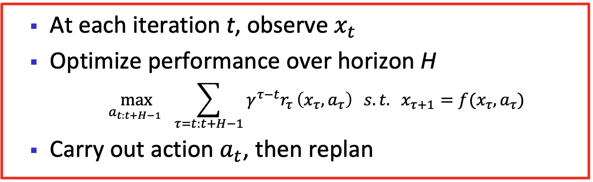
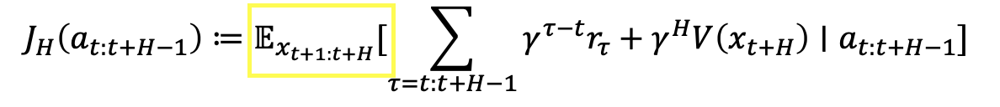
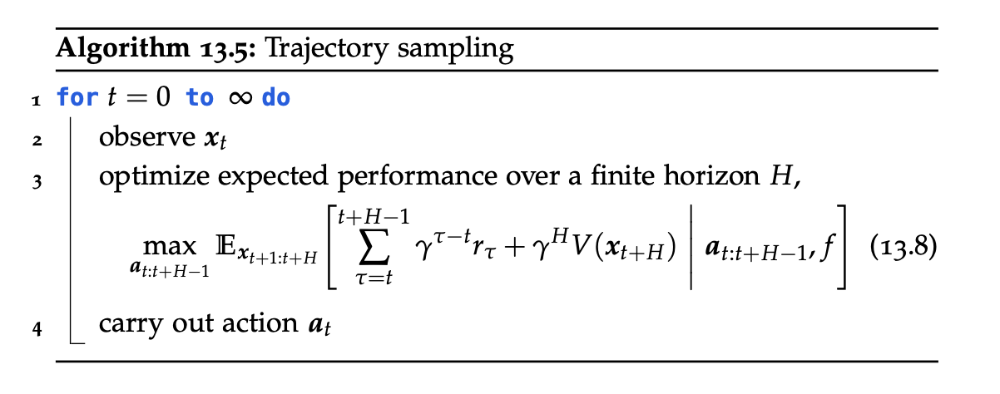
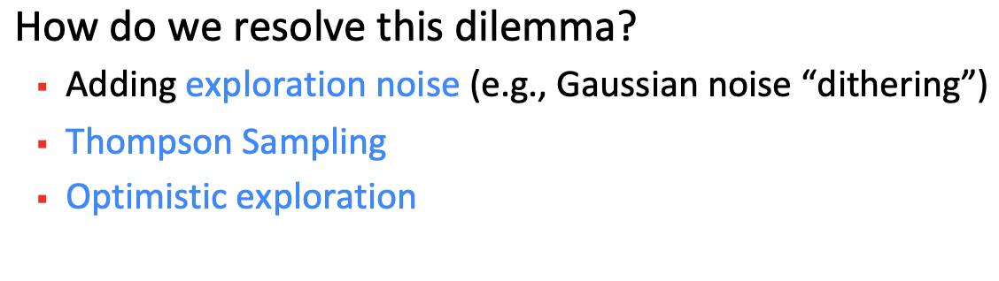
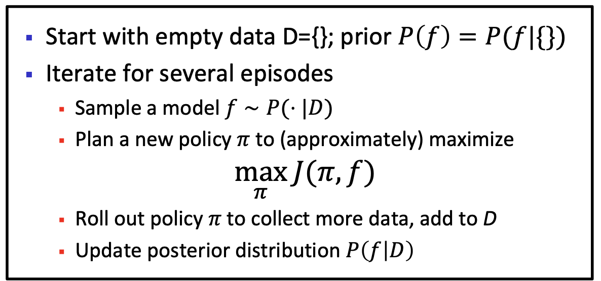
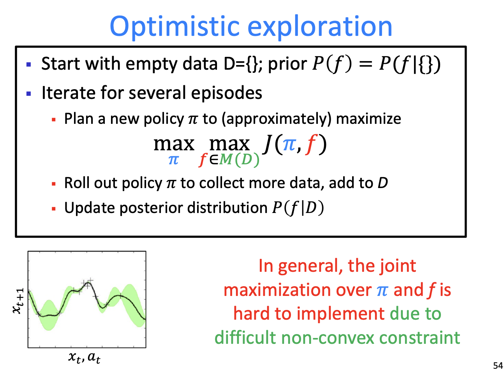

  
RL Notes · Chapter 6 · Model-Based

  <h1>Model-Based Approximate RL</h1>
  
Learning a model of the environment and planning with it.

**Contents**
* TOC
{:toc}

In model-based RL we want to learn the model of the environment, i.e. the transition probabilities and the reward function. We can then use the learned model to **plan** a new policy $\pi$.

We typically start with a policy $\pi$ and some initial dataset $D$. We iterate over many episodes: collect data from $\pi$, estimate $p, r$, then plan a new policy based on the estimated model.

So we cover:
- planning;
- learning $f, r$;
- the trade-off between exploration and exploitation.

# Planning

We focus on planning in <mark>continuous, fully observed state spaces with non-linear transitions, without constraints</mark>.

### Planning with a known deterministic model

Assume we have a known deterministic model for the dynamics:

$$
x_{t+1} = f(x_t, a_t).
$$

The objective is

$$
\max_{a_{0:\infty}}\, \sum_{t = 0}^{\infty} \gamma^t r(x_t, a_t) \quad \text{s.t.} \quad x_{t+1} = f(x_t, a_t).
$$

Since we are optimising over an infinite horizon, this problem cannot be solved directly.

### MPC: model-predictive control / RHC

**Solution:** plan over a <mark>finite horizon $H$</mark>, carry out the first action, then re-plan.

So at each iteration we solve an optimisation problem. For <mark>deterministic</mark> models $f$, $x_{\tau}$ is determined by $a_{t:\tau-1}$:

$$
x_{\tau} \coloneqq x_{\tau}(a_{t:\tau - 1}) = f(\,f(\,\ldots f(\,f(x_t, a_t),\, a_{t+1})\, \ldots,\, a_{\tau - 1}\,)\,).
$$

So at each step we maximise

$$
J_H(a_{t:t+H-1}) \coloneqq \sum_{\tau = t}^{t+H-1} \gamma^{\tau - t}\, r\!\left(x_{\tau}(a_{t:\tau - 1}),\, a_{\tau}\right).
$$

**How do we optimise this?** For continuous actions we can analytically compute gradients (BPTT), but it's challenging — so we usually use **heuristic global optimisation**.

*Example —* <mark>**random shooting**</mark>**:** a sampling approach for global optimisation of $J_H$. Generate <mark>$m$ sets</mark> of random samples $a^{i}_{t:t+H-1}$ and pick the sequence that optimises:

$$
i^{*} = \operatorname*{argmax}_{i \in \{1, \ldots, m\}} J_H(a^{i}_{t:t+H-1}).
$$

**Limitation:** a common problem of finite-horizon methods is that, in <mark>sparse-reward</mark> settings, there is often no signal to follow.

**Remark.** If we use the value estimate $V$, then for $H = 1$ maximising $J_H$ coincides with the <mark>**greedy policy**</mark> w.r.t. $V$:

$$
a_t \coloneqq \operatorname*{argmax}_{a \in \mathcal{A}} \hat{J}_1 = \text{greedy policy}.
$$

### MPC for stochastic transition models

For probabilistic transition models, MPC requires optimising:

<mark>Computing this expectation exactly requires solving a high-dimensional integral.</mark>

#### Monte Carlo trajectory sampling

A common approach: **Monte Carlo trajectory sampling**.

# Learning

Due to the Markovian structure of the MDP, observed transitions and rewards are (conditionally) independent. If we don't know the dynamics and reward, we can estimate them off-policy with standard supervised-learning techniques from a replay buffer.

For continuous state spaces, **learning $f$ and $r$ is essentially a regression** (density-estimation) problem. Each experience $(x, a, r, x')$ provides a labelled data point $(z, y)$, where $z \coloneqq (x, a)$ is the input and $y \coloneqq x'$ (resp. $r$) is the label.

How can we learn?
1. MAP estimation — but suffers from compounding errors.
2. Bayesian learning — learn a distribution over $f$:
   1. GP inference;
   2. approximate inference (Laplace, VI, …).

# Exploration vs. exploitation

## Thompson sampling

As in BO:

## Optimism

  <a class="post-nav-prev" href="./rl_approx">RL with Function Approximation</a>
  

