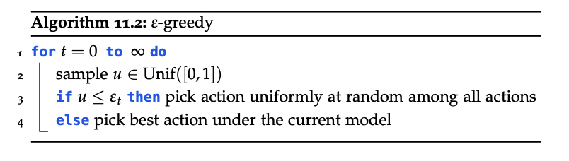
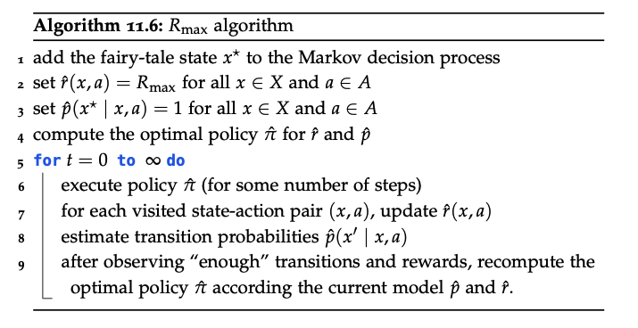
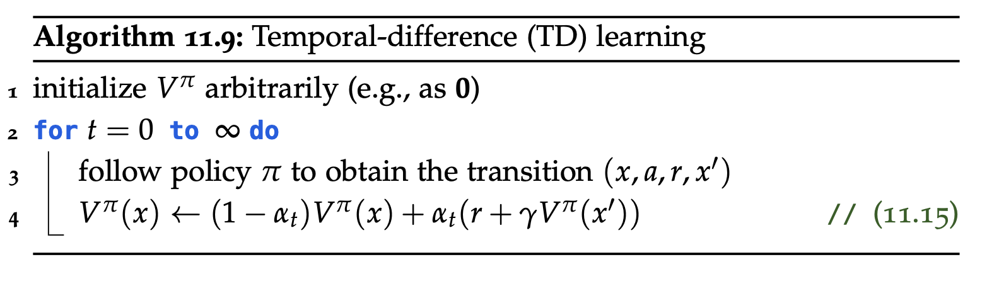

  
RL Notes · Chapter 4 · Tabular

  <h1>Reinforcement Learning — Tabular</h1>
  
An agent navigating MDPs with unknown dynamics, in finite state–action spaces.

**Contents**
* TOC
{:toc}

"An agent navigating through MDPs". The difference from the previous chapters is that in RL the policy can be randomised, and the dynamics are *unknown*. Reinforcement learning is concerned with probabilistic planning in unknown environments.

The crucial trade-off in RL is *exploration vs. exploitation*, as in Bayesian Optimisation (BO). The agent must decide whether it is better to explore and learn about the environment, or to exploit current knowledge to maximise reward.

In fact, BO can be seen as RL with a fixed state and continuous action space: in BO we used *regret* as a performance metric (minimising regret corresponds to maximising reward).

Before delving into RL definitions, recall what is different in RL from standard supervised learning:
- Data is not i.i.d.;
- The data we receive depends on our actions;
- Some actions yield higher rewards than others.

But what is "data" in RL? Data is collected dynamically from the environment, so it consists of *trajectories*.

# Data

Definition · Trajectory

A *trajectory* $\tau$ is a (possibly infinite) sequence

$$
\tau \doteq (\tau_0, \tau_1, \tau_2, \ldots)
$$

of transitions $\tau_i \doteq (x_i, a_i, r_i, x_{i+1})$, where $x_i$ is the starting state, $a_i$ the action played, $r_i \in \mathbb{R}$ the attained reward, and $x_{i+1}$ the ending state.

# Settings

Data collection is commonly classified into three settings:
1. **Episodic setting**: the agent performs a sequence of "training" rounds (called episodes); after each, the environment resets.
2. **Continuous setting** (non-episodic): the agent learns online, producing a single trajectory.
3. **Offline setting**: the agent must learn from a fixed dataset — a "library" of pre-recorded trajectories.

# Policy method

Another important distinction is *how* data is collected:
1. **On-policy** (learning by doing — and only from what you just did): the agent updates the policy using only data collected with the current policy (e.g. **SARSA**, **PPO**).
2. **Off-policy** (learning by watching others or your past self): the **target policy** (the one being learned) is different from the **behaviour policy** (the one used to generate the data); these methods are typically more sample-efficient (e.g. **Q-learning**, **DQN**).

# Model approach

There are two fundamental approaches to RL:
1. **Model-based RL**: aim to learn the underlying MDP. We estimate (learn) the *transition probabilities* $p$ and the reward function $r$.
2. **Model-free RL**: aim to learn the value function directly.

We begin with model-based methods.

# Model-based approach

We don't know how the world works, so we try to "build a map" (a model) of it from the data we've collected.

## Learning the MDP

We need to estimate the *transition probabilities* and the *reward function*:

$$
P(X_{t+1} = x' \mid X_t = x, A_t = a), \qquad r(X = x, A = a).
$$

To pick parameters that maximise the expected reward, we apply Maximum Likelihood Estimation (MLE) to the observed data. We treat each transition $x' \mid x, a$ as a sample from a categorical random variable and estimate its probabilities. Under the Markov assumption, estimating the *transition probabilities* reduces to a frequency count:

$$
\hat{p}(X_{t+1} \mid X_t, A) = \frac{\#(X_{t+1}, X_t, A)}{\#(X_t, A)},
$$

where the numerator counts the number of transitions from $x$ to $x'$ when playing action $a$. Similarly, the MLE of the reward is

$$
\hat{r}(x, a) = \frac{1}{\#(a \mid x)} \sum_{t \,:\, x_t = x,\, a_t = a} r_t.
$$

How do we handle the exploration–exploitation dilemma here?

## Exploration vs. exploitation dilemma

Given the current model, how do we choose actions? If we stick to exploitation we may get stuck in a sub-optimum; if we keep choosing actions at random, we will eventually estimate all probabilities and rewards correctly, but we'll perform poorly along the way.

So it really depends on the setting, but a good balance is achievable with "<mark>$\varepsilon$-greedy</mark>".

### $\varepsilon$-greedy

The simplest idea for a balance. At each time step $t$ we throw a biased coin. If it lands heads, we pick an action uniformly at random (exploration); if tails, we pick the best action under the current model (exploitation). The probability of heads at time $t$ is $\varepsilon_t$.

This is a general framework for trading off exploration and exploitation. Surprisingly, this simple algorithm works well in practice.

### Optimism

Recall from the multi-armed bandit problem that a key principle for trading off exploration and exploitation is *optimism in the face of uncertainty*. Applied to RL: assume the dynamics and reward estimates work in our favour — i.e. our estimates are at least as optimistic as the truth.

We look for *optimistic* estimates of $p, r$, yielding an optimistic underlying MDP biased towards exploration. The rewards from this MDP are upper bounds on the true rewards.

Technically, if $r$ and $p$ are unknown, we set

$$
\hat{r}(x^{*}, a) = R_{\max} \quad \forall a \in A,
$$

$$
\hat{p}(x^{*} \mid x^{*}, a) = 1 \quad \forall a \in A,
$$

i.e. the maximum reward an agent can get and the probability of staying in the *fairy-tale state* $x^{*}$.

In practice, the decision of when the estimates are *good enough* has to be tuned.

How many transitions do we need for *good enough* $p, r$ estimates? We use [Hoeffding's inequality](https://en.wikipedia.org/wiki/Hoeffding%27s_inequality): treating the transitions and rewards as **conditionally independent**, the inequality tells us that for the absolute approximation error to be below $\epsilon$ with probability at least $1 - \delta$, we need

$$
N(a \mid x) \geq \frac{R_{\max}^2}{2\epsilon^2}\, \log\frac{2}{\delta}.
$$

This yields the following theorem:

Theorem · Convergence of Rmax (Brafman &amp; Tennenholtz, 2002)

With probability at least $1 - \delta$, Rmax reaches an $\epsilon$-optimal policy in a number of steps polynomial in $\lvert X \rvert$, $\lvert A \rvert$, $T$, $1/\epsilon$, $1/\delta$, and $R_{\max}$.

## Challenges of the model-based approach

1. **Memory**: We must store all parameters; for each $x, a, x'$ we store $p$ and $r$. In the tabular setting this is $O(n^2 m)$.
2. **Computation time**: We must repeatedly solve the estimated MDP: $O(nm)$ per iteration.

# Model-free approach

Model-free methods estimate the value function directly. They do not need to remember the underlying MDP — only the value (or policy).

## On-policy value estimation

Suppose the agent uses a fixed policy $\pi$. Then we can estimate the *value function* as before:

$$
v^{\pi}(x) = r(x, \pi(x)) + \gamma \sum_{x' \in X} p(x' \mid x, \pi(x))\, v^{\pi}(x').
$$

A first idea is to estimate it via Monte Carlo. MC produces an unbiased estimate but requires complete trajectories, and the right-hand side still depends on $v^{\pi}$ itself. The key idea is to use a **bootstrapping** estimate of the value function instead. Bootstrapping is a core concept of model-free RL; it generally produces *biased* estimates, but with much lower variance and faster updates.

One way to compute the value-function update from samples is to mix **new** estimates with previous estimates using a learning rate $\alpha_{t}$. This yields the temporal-difference (TD) algorithm:

(We use a lookup table for the values given the state.)

## SARSA
### On-policy
### Off-policy

## Off-policy value estimation

At state $x$, pick an action $a$ to obtain a transition $(x, a, r, x')$. Then update the value estimate using **bootstrapping**:

$$
\hat{Q}^{\pi}(x, a) \leftarrow (1 - \alpha_t)\, \hat{Q}^{\pi}(x, a) + \alpha_t\!\left(r + \gamma\, \underbrace{\hat{Q}^{\pi}(x', \pi(x'))}_{\hat{V}^{\pi}(x')}\right).
$$

As for the on-policy case, we have the convergence theorem:

Theorem · Convergence

If the learning rate $\alpha_t$ satisfies $\sum_t \alpha_t = \infty$ and $\sum_t \alpha_t^2 < \infty$, and all state–action pairs are visited infinitely often, then $\hat{Q}^{\pi}$ converges to $Q^{\pi}$ with probability 1.

**Remark:** this is **off-policy** because action $a$ does not need to be picked following $\pi$.

## Optimal value estimation

Recall that:
1. The optimal value function $V^{*}(x)$ induces the optimal policy $\pi^{*}$.
2. For the optimal value function, $V^{*}(x) = \max_a Q^{*}(x, a)$, where $Q^{*}(x, a) = r(x, a) + \gamma \sum_{x'} P(x' \mid x, a)\, V^{*}(x')$.

So the idea is to estimate $Q^{*}(x, a)$ directly from samples. Below are some of the most common ways to do so.

### 1) Q-learning

Suppose we have an initial estimate $\hat{Q}^{*}(x, a)$ and observe a transition $(x, a, x')$ with reward $r$. The update is

$$
\hat{Q}^{*}(x, a) \leftarrow (1 - \alpha_t)\, \hat{Q}^{*}(x, a) + \alpha_t\!\left(r + \gamma\, \max_{a'} \hat{Q}(x', a')\right).
$$

Theorem · Convergence

If $\sum_t \alpha_t = \infty$ and $\sum_t \alpha_t^2 < \infty$, and all state–action pairs are visited infinitely often, then $\hat{Q}^{*}$ converges to $Q^{*}$ with probability 1.

How do we handle the exploration–exploitation trade-off? Two options:
- $\varepsilon$-greedy;
- optimistic exploration.

#### 1.1 Convergence of optimistic Q-learning

Similar to Rmax: initialise

$$
\hat{Q}^{*}(x, a) = \frac{R_{\max}}{1 - \gamma} \prod_{t = 1}^{T_{\text{init}}} (1 - \alpha_t)^{-1}
$$

and at time $t$ pick $a_t \in \operatorname*{argmax}_a \hat{Q}^{*}(x_t, a)$.

Theorem

With probability $1 - \delta$, optimistic Q-learning obtains an $\varepsilon$-optimal policy in a number of time steps polynomial in $\lvert X \rvert$, $\lvert A \rvert$, $1/\varepsilon$, and $\log(1/\delta)$.

**Properties:**
- Memory: store $\hat{Q}^{*}(x, a)$ for each $(x, a)$ — $O(n \cdot m)$.
- Computation time: $O(m)$ per iteration to compute $\operatorname*{argmax}_a \hat{Q}(x_t, a)$.

### Neural Fitted Q-iteration / DQN

To accelerate Q-learning with (neural) function approximation:
- use "experience replay" — maintain a dataset $D$ of observed transitions;
- clone the network to maintain constant "target" values across episodes.

$$
L(\theta) = \sum_{(x, a, r, x')} \left(r + \gamma\, \max_{a'} Q(x', a'; \theta^{\text{old}}) - Q(x, a; \theta)\right)^2.
$$

The fundamental idea of Q-learning is that it chooses the next action by implicitly defining a policy via

$$
a_t = \operatorname*{argmax}_a Q(x_t, a; \theta),
$$

but this is **intractable** for large or continuous action spaces.

## Policy search methods

Learn a parametrised policy (actor): $\pi(x) = \pi_{\theta}(x) = \pi(x; \theta)$. For episodic tasks (i.e. when the agent can be reset), expected rewards can be computed by "rollouts" (Monte Carlo forward sampling — on-policy). The idea is to find optimal parameters via global optimisation:

$$
\theta^{*} = \operatorname*{argmax}_{\theta} J(\theta) \approx \operatorname*{argmax}_{\theta} \hat{J}_T(\theta).
$$

  <a class="post-nav-prev" href="./rl_hmm">Hidden Markov Models</a>
  <a class="post-nav-next" href="./rl_approx">RL with Function Approximation</a>

