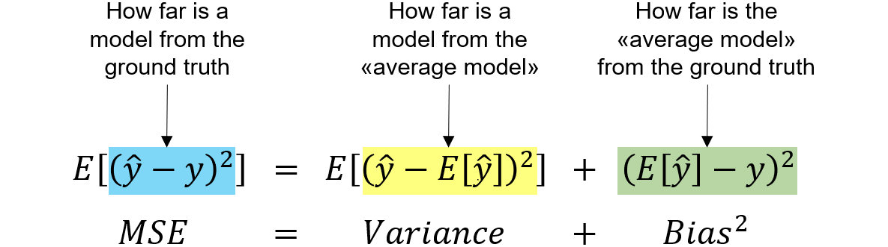

# Deep Learning

## Single Layer Neural Networks

{width="50%"}

A single layer Neural Network is composed by at least 3 layers: an Input
layer, vector of $p$ variables $X_1, X_2, \dots, X_p$, a Hidden layer,
and an Output layer, a single variable $Y$. The Hidden layer is composed
by $M$ nodes, each node is a linear combination of the input variables
$X_1, X_2, \dots, X_p$ and a non-linear function, the *activation
function* $\sigma$. The neural network builds a *nonlinear function*
that predict the output vector, the response, $Y$. It is called single
because it has only one hidden layer.\
\
We have already seen some methods for nonlinear prediction, but this is
different beacuse of the *structure* of the model. The image 7.1 shows a
*feedforward neural network*, for modeling a qunatitative response with
4 predictors.\
The arrows indicate that each of the inputs from the input layer feeds
into each of the $K$ **hidden units**. The neural network has a
mathematical form as:
$$f(X) = \beta_0 + \sum_{k=1}^{K} \beta_k h_k(X)$$\
\
Each layer has a predifined number of units $K$. Eaxh unit is composed
of 3 elements:

-   Two trainable parameters for each input: $w$ as **weight** and
    $\beta$ as **bias**; The coefficient and the intercept.

-   A *nonlinear* **activation function** $g()$.

For an input vector $X = (X_1, X_2, \dots, X_p)$, the output of each
$k$th activation unit is:
$$A_k = h_k(X) = g(\beta_{0k} + \sum_{j=1}^{p} w_{jk}X_j)$$ The output
vector is $A = (A_1, A_2, \dots, A_K)$.\
\
We can think of each $A_k$ as a different trasformations $h_k(X)$ of the
original features.\
Then, these $K$ activations from the hidden layer feed into the output
layer, resulting in:
$$f(X) = \beta_0 + \sum_{k=1}^{K} \beta_k A_k = \beta_0 + \sum_{k=1}^{K} \beta_k g(\beta_{0k} + \sum_{j=1}^{p} w_{jk}X_j)$$
A linear regression model with the transformed features $A_k$ as
predictors.\
All the parameters $\beta_{0k}, w_{jk}, \beta_k$ and the weights $w$ are
estimated from the data minimizing the squared error loss. The **Loss
function** to minimize in order to estimate the parameters is the
already known *Mean Squared Error*. In the early days of NN the
activation function was the *sigmoid function*:
$$g(z) = \frac{1}{1 + e^{-z}}$$ which is the same function used in
logistic regression to convert a linear function into probabilities
between 0 and 1. Nowadays, the preferred activation function is the
*Rectified Linear Unit* (ReLU): $$g(z) = \max(0, z) = \begin{cases}
    z & \text{if } z > 0 \\
    0 & \text{if } z \leq 0
\end{cases}$$ Although it thresholds at zero, because we apply it to a
linear function, the constant term $w_k0$ will shift this inflection
point.\
In other words, the model :
$$f(X) = \beta_0 + \sum_{k=1}^{K} \beta_k g(\beta_{0k} + \sum_{j=1}^{p} w_{jk}X_j)$$
derives $K$ new features by copmuting $K$ linear combinations of the
original features $X_1, X_2, \dots, X_p$ and then squashes them with the
activation function $g()$. The final model is a linear regression model
with the new features as predictors.\
\
**Remark:** It is essential that the activation function is a
*nonlinear* function, so the model is a *nonlinear* model.

## Multilayer Neural Networks

When we have more than one hidden layer we have a **Multilayer Neural
Network**. The model is more complex, but the idea is the same. The
model is a linear regression model with the new features as predictors.
When adding a new hidden layer, the output of the preceding layer will
become the input.

{width="50%"}

Now, for example, if we want to train a multilayer neural network to a
qualitative response, so using the *softmax* function to convert the
output to probabilities:
$$f_m(X) = P(Y=m | X) = \frac{e^{Z_m}}{\sum_{l=0}^{C} e^{Z_{l}}}$$ where
$h_j(X)$ is the output of the $j$th unit in the hidden layer. The model
is a linear regression model with the new features as predictors. The
parameters are estimated by minimizing the *negative multinomial
likelihood*.

, we look for coefficients estimates that minimize the **negative
multinomial likelihood**:
$$- \sum_{i=1}^{n} \sum_{m=1}^{M} y_{ik} \log (f_m(x_i))$$ also known as
the **cross-entropy loss**.

## Fitting a Neural Network

So, the easiest way to fit a neural network is to minimize the error
function, e.g. the MSE:
$$\min_{w, \beta_0, \beta_1, \ldots, \beta_p} \frac{1}{2} \sum_{i=1}^{n} (y_i - f(x_i))^2$$

where $f(x_i)$ is the output of the neural network:
$$f(x_i) = \beta_0 + \sum_{k=1}^{K} \beta_k g(\beta_{k} + \sum_{j=1}^{p} w_{jk}x_{ij})$$
The goal is to find the couple $(w, \beta)$ that minimizes the error. We
can do that using **Gradient Descent**. Suppose we represent all the
parameters in one long vector
$\theta = (\beta_0, \beta_1, \ldots, \beta_K, w_{11}, w_{12}, \ldots, w_{Kp})$.
Then we can rewrite the objective (7.1) as:
$$R(\theta) = \frac{1}{2} \sum_{i=1}^{n} (y_i - f_{\theta}(x_i))^2$$ The
intuition of the gradient descent algorithm is the following: We start
with a guess $\theta_0$, we then cevaulate R in that point and we also
compute the derivative in that point. If thw values obtained are smaller
than the value of the function in the previous point, we move in that
direction. We repeat this process until we reach a minimum.

## Backpropagation

How do we find and compute this values of $R(\theta)$ and its
derivative? The answer is the **Backpropagation** algorithm. The idea is
to compute the derivative of the error function with respect to each
parameter. The algorithm is based on the *chain rule* of calculus.\
\
Basically, we compute the **gradient** $R(\theta)$ at a timestamp $m$:
$$\nabla R(\theta^m) =  \frac{\partial R(\theta)}{\partial \theta} \bigg|_{\theta = \theta^{(m)}}$$

So we compute the derivative in the point $\theta^{(m)}$, this gives us
the direction for $\theta$ in which R increases. So we want to move in
the /textitopposite direction. We update the parameters as:
$$\theta^{(m+1)} = \theta^{(m)} - \eta \nabla R(\theta^m)$$ where $\eta$
is the *learning rate*, a hyperparameter that we decide. For small
values of $\eta$ the algorithm slowly reduce R:
$$R(\theta^{(m+1)}) < R(\theta^{(m)})$$ The algorithm is repeated until
the gradient is zero. Then, we arrived to the *local minimum* of the
function.\
\
**Remark:** The algorithm does not gurantee the global minimum, but only
a local minimum.\
\
The calculation of the gradient in (7.2) is pretty easy thanks to the
*chain rule* since R is a sum, its gradient it's also a sum over the $n$
observations.\
\
Since $R(\theta)= \sum_{i=1}^{n} R_i(\theta)$, the gradient is the sum
of the terms:
$$R_i(\theta) = \frac{1}{2} (y_i - f_{\theta}(x_i))^2 = \frac{1}{2} \left( y_i -\beta_0 - \sum_{k=1}^{K} \beta_k g (w_{k0} + \sum_{j=1}^{p}w_{kj}x_{ij}) \right)^2$$
to simplify the notation we can write
$z_{ik} = w_{k0} + \sum_{j=1}^{p}w_{kj}x_{ij}$. So to compute the
gradient we first take the derivative with respect to $\beta_k$:

$$\frac{\partial R_i(\theta)}{\partial \beta_k} = \frac{\partial R_i(\theta)}{\partial f_{\theta}(x_i)}\cdot \frac{\partial f_{\theta}(x_i)}{\partial \beta_k} = - (y_i - f_{\theta}(x_i)) \cdot g(z_{ik})$$

And now we take the derivative woth respect to $w_{kj}$:

$$\frac{\partial R_i(\theta)}{\partial w_{kj}} = \frac{\partial R_i(\theta)}{\partial f_{\theta}(x_i)}\cdot \frac{\partial f_{\theta}(x_i)}{\partial g(z_{ik})} \cdot \frac{\partial g(z_{ik})}{\partial z_{ik}} \cdot \frac{\partial z_{ik}}{\partial w_{kj}}= - (y_i - f_{\theta}(x_i)) \cdot \beta_k \cdot g'(z_{ik}) \cdot x_{ij}$$

We notice that in (7.3) and (7.4) we have the same residual term
$-(y_i - f_{\theta}(x_i))$. In (7.3) a fraction of this residual is
attribuited to each of of the hidden units, according to $g(z_{ik})$. In
(7.4) the residual is attribuited in similar way to input $j$ via hidden
unit $k$. In other words, the act of differentiating assigns a fraction
of the residual to each of the parameters via the chain rule. This
process is known as *backpropagation*.

[]{#sec:appendix label="sec:appendix"}

# Useful Statistics to Remember

We remember here some important statistic relations that are helpful to
understand better the meaning of the contents of this document.\
\
Given a estimator $\hat{\theta}$ of a parameter $\theta$ we can say that
the **Mean squared error** of the estimator is:
$$MSE(\hat{\theta}) = E[(\hat{\theta} - \theta)^2]$$\
The **Bias** of an estimator is defined as:
$$Bias(\hat{\theta}) = E[\hat{\theta}] - \theta$$\
The **Variance** of an estimator is defined as:
$$Var(\hat{\theta}) = E[(\hat{\theta} - E[\hat{\theta}])^2]$$\
We remember than the importnat relation of the MSE with the Bias and the
variance, which is the explanation for the *Bias-Variance Tradeoff*:
$$MSE(\hat{\theta}) = Var(\hat{\theta}) + Bias(\hat{\theta})^2$$

{width="50%"}

[^1]: $\epsilon = Y - \hat{Y}$ is the error associated with each
    resposne measurement. represents the random deviation or \"noise\"
    between the observed values and the values predicted by the model.
    It captures the variability in the response variable that cannot be
    explained by the predictor variables included in the model.

[^2]: means that the dot product (or scalar product) between any two
    distinct vectors in the basis is zero. Geometrically, this indicates
    that the vectors are mutually perpendicular. Moreover the norm of
    the vector is 1.
