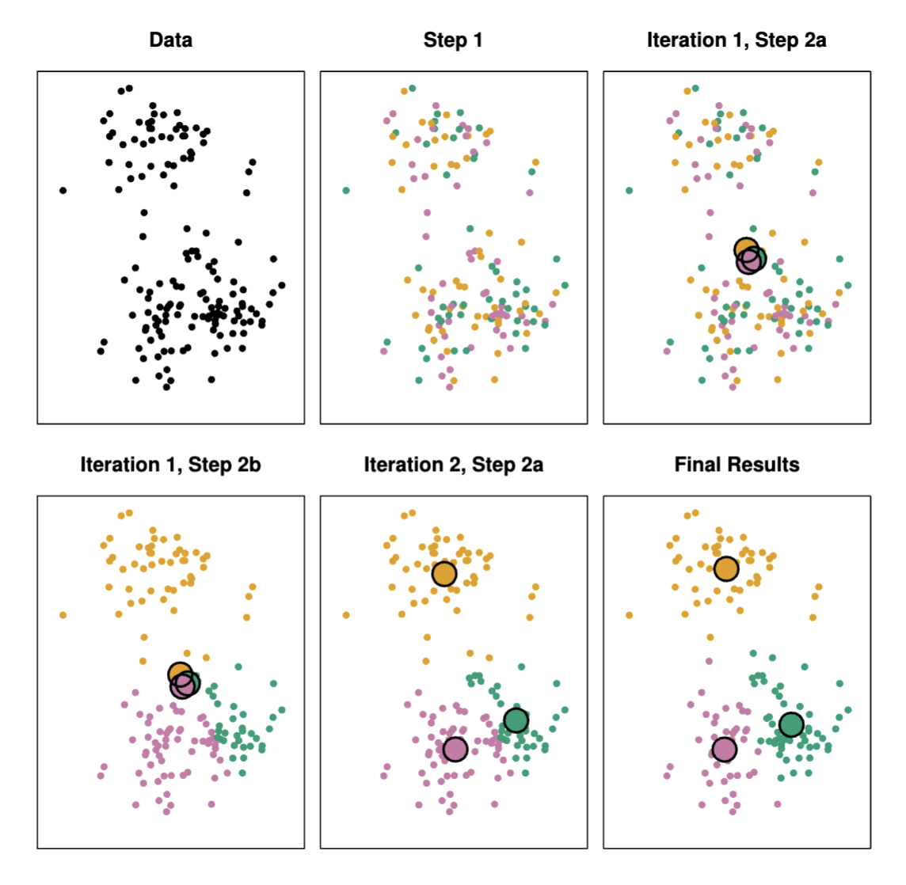

# Unsupervised Learning

Until now, we have explored supervised learning methods, such as linear
regression and classification, where we had n observation and p features
$X_1, X_2, \dots, X_p$ and a response variable $Y$. In unsupervised
learning, we have only the features $X_1, X_2, \dots, X_p$ and [no
associated response]{.underline}. The goal is to discover interesting
things about the data, such as the presence of subgroups among the
observations, or the relationships between the variables.

## Principal Components Analysis

We already talked about PCA in the [Principal Component
Regression](#sec:sec:PCR). When faced with a large set of correlated
variables, principal components allow us to summarize this set with a
smaller number of representative variables that collectively explain
most of the variability in the original set. The principal component
directions are represented as the directions in feature space along
which the original data are highly variable.To perform principal
components regression, we simply use principal components as predictors
in a regression model in place of the original larger set of variables.

::: definition
Principal components analysis (PCA) refers to the process by which
principal components are computed, and the subsequent use of these
components in understanding the data. PCA is an unsupervised approach,
since it involves only a set of features $X_1, X_2, . . . , X_p$, and no
associated response Y.
:::

In other words, PCA produces a low-dimensional representation of a
dataset. It finds a sequence of linear combinations of the variables
that have maximal variance, and are mutually uncorrelated.\
\
The principal component $Z_1$ is a linear combination that has the
hisghest variance across the dataset.
$Z_1 = \phi_{11}X_1 + \phi_{21}X_2 + \dots + \phi_{p1}X_p$. The
coefficients $\phi_{11}, \phi_{21}, \dots, \phi_{p1}$ are called the
*loadings* of the first principal component. The first principal
component vector $\phi_1 = (\phi_{11}, \phi_{21}, \dots, \phi_{p1})$
defines the direction in feature space along which the data varies the
most. The projected $n$ data points are the principal components scores
$z_{11}, z_{21}, \dots, z_{n1}$.\
In other words, we look for the line that maximizes the variance
(maximal information retained by the data) of the projected data that is
the same that minimize the error of the projection (minimizing the error
between the original data and its reconstruction). The *total
reconstructing error* is the averaged squared Euclidean distance between
the original data and the reconstructed data (matrix form):
$$\frac{1}{N} \sum_{n=1}^{N} ||x _{n} - \hat{x}_{n}||^2$$ where
$\hat{x}_{n}$ is the projection of $x_n$ onto the line spanned by the
first principal component. It can be shown that the first principal
component is the line that minimizes reconstruction error an that
maximize the variance of the projected data.\
\
The geometrical explaination of PCA is that the first principal
component vector $\phi_1$ defines the line that is as close (in terms of
Euclidean distance) as possible to the data. The second principal
component is the line that is orthogonal to the first line and that is
as close as possible to the data. The third principal component is
orthogonal to the first two and so on. So, for instance, the first two
principal components of a data set span the plane that is closest to the
n observations, in terms of average squared Euclidean distance. But
since the projection of a point is orthogonal to the principal component
line, the sum of the principal compenent line with the projection of the
point is equal to the the average squared distance between the $centre$
of the data and the point.\
\
**Remark:** If the variables are in different units, scaling each to
have standard deviation equal to one is recommended.\
\
We can now ask a natural question: how much of the information in a
given data set is lost by projecting the observations onto the first few
principal components? That is, how much of the variance in the data is
not contained in the first few principal components?\
In general, we are interested in knowing the ***proportion of variance
explained* (PVE)** by each principal component, to understand the
strength of each component. The PVE of the $m$th principal component is:
$$PVE_m = \frac{\sum_{i=1}^{n} (z_{im})^2}{\sum_{i=1}^{n} \sum_{j=1}^{p} x_{ij}^2}$$
The PVE of each principal component is a positive quantity and is the
explained variance ratio for the first two principal components is
displayed, providing insight into how much of the dataset's variance
these two components capture.Understanding explained variance is
essential because we aim to reduce dimensions without losing too much
information and an high explained variance in the first few PCs
indicates that we can capture most of the dataset's information with
fewer dimensions, simplifying analysis and visualization.\
Moreover, components with high explained variance reveal the dominant
patterns in the data, which are useful for understanding relationships
or clustering trends.

## Clustering

Clustering refers to a very broad set of techniques for finding
subgroups, or clusters, in a data set. We seek a partition of the data
into distinct groups so that the observations within each group are
quite similar to each other. Therefore, we must define what it means for
two or more observations to be similar or different. Clustering looks
for homogeneous subgroups among the observations.\
\
We have two type of Clustering:

-   In **K-means** clustering, we seek to partition the observations
    into a pre-specified number of clusters.

-   In **hierarchical clustering**, we do not know in advance how many
    clusters we want; in fact, we end up with a tree-like visual
    representation of the observations, called a dendrogram, that allows
    us to view at once the clusterings obtained for each possible number
    of clusters, from 1 to n.

### K-Means Clustering

::: definition
Let $C_1, \ldots, C_K$ denote sets containing the indices of the
observations in each cluster. These sets satisfy two properties:

1.  $C_1 \cup C_2 \cup \ldots \cup C_K = \{1, \ldots, n\}$. In other
    words, each observation belongs to at least one of the $K$ clusters.

2.  $C_k \cap C_{k'} = \emptyset$ for all $k \neq k'$. In other words,
    the clusters are non-overlapping: no observation belongs to more
    than one cluster.

For instance, if the $i$th observation is in the $k$th cluster, then
$i \in C_k$.
:::

The idea behind K-means clustering is that a good clustering is one for
which the *within-cluster variation* is as small as possible. This
measure is called $W(C_k)$, the within-cluster variation for the $k$th
cluster, which is a measore of the amount by which the observations
within a cluster differ from each other.\
\
Hence, we want to solve the problem:
$$\min_{C_1, \ldots, C_K} \left( \sum_{k=1}^{K} W(C_k) \right)$$ In
words, this formula says that we want to partition the observations into
K clusters such that the total within-cluster variation, summed over all
K clusters, is as small as possible.\
How is $W(C_k)$ defined? We use the Euclidean distance:
$$W(C_k) = \frac{1}{|C_k|} \sum_{i, i' \in C_k} \sum_{j=1}^{p} (x_{ij} - x_{i'j})^2$$
where $|C_k|$ denotes the number of observations in the $k$th cluster.
In other words, $W(C_k)$ is the sum of all of the pairwise squared
Euclidean distances between the observations in the $k$th cluster,
divided by the total number of observations in the $k$th cluster.\
Thus, combining (6.1) and (6.2), we can write the K-means clustering
problem as:
$$\min_{C_1, \ldots, C_K} \left( \sum_{k=1}^{K} \frac{1}{|C_k|} \sum_{i, i' \in C_k} \sum_{j=1}^{p} (x_{ij} - x_{i'j})^2 \right)$$

The algorithm for K-means clustering is as follows:

1.  Randomly assign a number, from 1 to K, to each of the observations.
    These serve as initial cluster assignments for the observations.

2.  Iterate until the cluster assignments stop changing:

    1.  For each of the K clusters, compute the cluster *centroid*. The
        kth cluster centroid is the vector of *the p feature means* for
        the observations in the kth cluster.

    2.  Assign each observation to the cluster whose centroid is closest
        (where closest is defined using Euclidean distance).

{K-means clustering algorithm example. Final result after 10
iterations.}

This algorithm is guaranteed to decrease the value of the objective 1.5
at each step, because:
$$\frac{1}{|C_k|} \sum_{i, i' \in C_k} \sum_{j=1}^{p} (x_{ij} - x_{i'j})^2 = 2 \sum_{i \in C_k} \sum_{j=1}^{p} (x_{ij} - \bar{x}_{kj})^2$$
where $\bar{x}_{kj}$ is the mean of the observations in the kth cluster.
The right-hand side of (6.4) is minimized when each observation is
assigned to the cluster with the closest centroid. This means that as
the algorithm is run, the clustering obtained will continually improve
until the result no longer changes. When the result no longer changes, a
*local optimum* has been reached. Then one selects the best solution,
i.e. that for which the objective (6.3) is smallest\
\
K-means algorithm finds a local rather than a **global optimum**, the
results obtained will depend on the initial (random) cluster assignment
of each observation in Step 1 of the algorithm. For this reason, it is
important to run the algorithm multiple times from different random
initial configurations.\
\
Scaling of the variables matters!\
\
How many clusters to choose? For K-means, the Elbow method is popular,
but it is subjective and depends on application. Also it measures a
global clustering characteristic only. For an in-depth discussion see
Elements of Statistical Learning, chapter 14 for more details.
