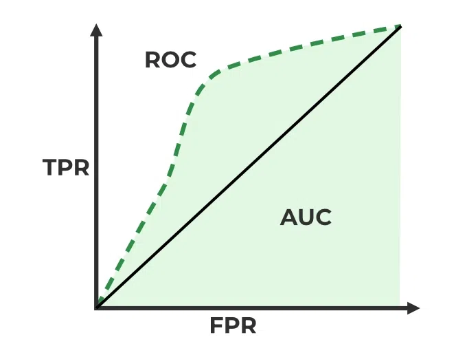

# Classification

## Classification

With linear regression we established a method to predict number values,
but a lot of times we would like to predict qualitative values, such as
labels or classes, to do that we need a new model that predict
*probabilities* and not numbers. This is the **Classification** model.
We said earlier that we can use categorical variables also for linear
regression, but that is not raccomended, because the model is not able
to predict probabilities, and a regression method cannot accommodate a
qualitative response with more than two classes.

### Logistic Regression

Logistic regression, is a well-suited method for the case of a
**binary** qualitative response.\
\
**Remark:** logistic regression is a structured model approach, rather
than a data-centric approach.\
\
Given two classe, 0 and 1, we can model the probability that Y belongs
to a class as: $$P(Y = 1 | X) = \beta_0 + \beta_1 X = p(x)$$ But, as it
is clear to see, if we try to fit a binary model in this linear model we
will have a problem. To avoid this problem, we model $p(x)$ using a
squashing function, that gives output between 0 and 1, such as the
**logistic function**:
$$p(x) = \frac{e^{\beta_0 + \beta_1 X}}{1 + e^{\beta_0 + \beta_1 X}}$$
So, if we want to fit the model, we have to estimate the coefficients
$\beta_0$ and $\beta_1$ that maximize the \"likelihood\" of the data. To
get rid off the exponential expression of the logistic function we
consider the **odds** instead of the probabilities.

::: definition
We define the **odds** as the ratio of the probability of success (1) to
the probability of non-success(0). In terms of probabilities, the odds
is defined as the ratio of the probability of the event happening to the
probability of the event not happening.
$$\text{Odds} = \frac{p(x)}{1 - p(x)}$$ **Remark:** The odds can take
values between 0 and $\infty$.
:::

After a bit of manipulation, we can rewrite the logistic function as:

$$\frac{p(x)}{1 - p(x)} = e^{\beta_0 + \beta_1 X}$$

and after taking the logarithm of both sides we get the **log-odds** or
**logit** function:
$$\log \left( \frac{p(x)}{1 - p(x)} \right) = \beta_0 + \beta_1 X$$
Although we could use (non-linear) least squares to fit the model in the
above logit, the more general method of maximum likelihood is preferred.
Given that, the estimation of the coefficients for the logistic
regression method is done by maximizing the likelihood of the data,
which is the product of the probabilities of the observed data. We
choose $\beta_0$ and $\beta_1$ to maximize the probabilityof the data of
belonging to one class.

#### Multiple Logistic Regression

We now consider the problem of predicting a binary response using
multiple predictors. We can simply generalize the logit function to the
case of multiple predictors:\
$$\log \left( \frac{p(x)}{1 - p(x)} \right) = \beta_0 + \beta_1 X_1 + \beta_2 X_2 + \dots + \beta_p X_p$$\
And then apply the MLE for estimating the coefficients.\
\
**Remark:** Also here as for the multiple linear regression we can have
*confounding variables* that create errors.

#### Multinomial Logistic Regression

The multinomial logistic regression is used when the response variable
has more than two classes, $K>2$. It is basically the extension of the
logistic regression model to the case of more than two classes.\
wee do that by setting a class $K$ as the baseline, compute
$P(Y=K | X = x)$ and then compute $P(Y = k | X)$ for all the other
classes $k \neq K$; we can show that the logit in this case is, for all
the classes $k \neq K$:
$$\log \left( \frac{P(Y = k | X=x)}{P(Y = K | X= x)} \right) = \beta_{k0} + \beta_{k1}x$$
This equation indicates that the log-odds that an observation belongs to
class $k$ is a linear function of the predictors.

### Generative models for Classification

This is an alternative way to logistic regression for classification.\
**Idea**: We would like to model the distribution of the data in each
class, and then use Bayes' theorem to compute the probability of
belonging to a class given the data. Whereas in logistic regression we
have used the logistic function to model the probability of belonging to
a class given the data.\
\
**Main reasons to use this instead of logistic regression:**

1.  When n is small and the distribution of the predictors X is
    approximately normal in each of the classes, the linear discriminant
    model is more stable than the logistic regression model. When there
    is substantial separation between the two classes, the parameter
    estimates for the logistic regression model are surprisingly
    unstable. The methods that we consider in this section do not suffer
    from this problem.

2.  We can plug in the estimation of the prior and the posterior.

We remember that the Bayes' theorem is:
$$P(Y = k | X = x) = \frac{P(X = x | Y = k)P(Y = k)}{P(X = x)}$$ We can
rewrite this by considering the **prior** probability $\pi_k$ of the
class k, which is: $$\pi_k = P(Y = k)$$ and the density function of an
observation $x$ given the class $k$, which is called **posterior**
probability of an observation belonging to the class $k$,
$$f_k(x) = P(X = x | Y = k)$$\
We can rewrite the Bayes' theorem as:
$$P(Y = k | X = x) = \frac{\pi_k f_k(x)}{\sum_{l=1}^{K} \pi_l f_l(x)}$$
This is called the **Bayes approach** to classification.

#### Linear Discriminant Analysis-LDA

The LDA is a bayes approach model that uses one predictor , $p = 1$, and
assumes that the densities of the predictors in each class are
**normally (Gaussian) distributed**. It si linear because the the
discriminant function is linear in $x$:
$$\delta_k(x) = x \frac{\mu_k}{\sigma^2} - \frac{\mu_k^2}{2\sigma^2} + \log(\pi_k)$$
where $\mu_k$ is the mean of the predictor in the class $k$, $\sigma^2$
is the variance of the predictor in the class $k$ and $\pi_k$ is the
prior probability of the class $k$.\
\
If we have more than one parameter, we can generalize the LDA to the
case of multiple predictors, $p > 1$. This is called the **GDA**
(Generalized Discriminant Analysis).\
Here we make the assumption that all the predictors are normally
distributed in each class, and that the **covariance matrix of the
predictors is the same in each class**. But the mean is class-specific:
$\mu_k$.\
\
**Advantages:**

-   Linear, simplier and stable.

-   Better for small datasets.

-   Lower variance (higher bias), because we have the assumption that is
    linear.

An interesting thing to notice is the so called **Decision Buonderies**.
The decision bounderies is when: $$\delta_k(x) = \delta_l(x)$$ This is
the line that separates the two classes, and it is linear in the case of
LDA.\
In the case of $K=2$ and if $\pi_k = \pi_l$ we have that the decision
boundary is: $$x = \frac{\mu_1 + \mu_2}{2}$$

The QDA (Quadratic Discriminant Analysis) is another bayes approach to
classification and it assumes that the densities of the predictors are
normally (Gaussian) distribuited, but it also assumes that each classes
has a **different covariance matrix** $\Sigma_k$!\
\
Unlike the LDA the discriminant function is quadratic in $x$:
$$\delta_k(x) = -\frac{1}{2} \log(|\Sigma_k|) - \frac{1}{2} (x - \mu_k)^T \Sigma_k^{-1} (x - \mu_k) + \log(\pi_k)$$\
\
**Advantages:**

-   Quadratic Buonderies: More flexible, can capture more complex
    decision boundaries.

-   Better for large datasets.

-   Lower bias (Higher variance).

#### Naive Bayes

The Naive Bayes is a bayes approach to classification that is based on
the assumption that the predictors are **independent**. Whereas for LDA
and QDA we have assumed that the predictors are normally distributed
(multivariate normal distribution).\
Given this strong assumption we know that we can compute the posterior
probability of the class $k$, the density $f_k(x)$ given the data $x$
as: $$f_k(x) = \prod_{j=1}^{p} f_{kj}(x_j)$$ where $f_{kj}(x_j)$ is the
density of the predictor $x_j$ in the class $k$.\
\
By assuming that the $p$ covariates are independent within each class,
we completely eliminate the need to worry about the association between
the p predictors, because we have simply assumed that there is no
association between the predictors.\
That is why we can compute the joint distribution of the predictors as
the product of the marginal distributions of the predictors.\
\
**Remark:** We have a problem if we introduce a predictor for which the
density is zero in a class,\
$P(X=X|Y=k)=  0 = f_k(x)$, because the product of the densities will be
zero, and so the posterior probability will be zero.\
\
**Advantages:**

-   Introduce Bias but has LOW Variance.

-   Useful with a lot of predictors.

-   Can handle both quantitative (continuos) and qualitative (discrete)
    data.

### Evaluation of Classification Models

It is common practice to test the model on a test set, a validation set,
and asses its perfomances using some metrics. In this section we will
use this terms:

-   **True Positive (TP)**: The number of positive cases that are
    **correctly** classified as positive.

-   **True Negative (TN)**: The number of negative cases that are
    **correctly** classified as negative.

-   **False Positive (FP)**: The number of negative cases that are
    **incorrectly** classified as positive.

-   **False Negative (FN)**: The number of positive cases that are
    **incorrectly** classified as negative.

1.  **Accuracy**: The proportion of cases classified correctly. It is
    the ratio of the correct prediction over all the predictions:
    $$\text{Accuracy} = \frac{TP + TN}{TP+TN+FP+FN}$$

2.  **Confusion Matrix**: A tabular display (2×2 in the binary case) of
    the record counts by their predicted and actual classification
    status:

    ::: {#tab:confusion_matrix}
                                 **Actual: Positive**   **Actual: Negative**
      ------------------------- ---------------------- ----------------------
       **Predicted: Positive**           (TP)                   (FP)
       **Predicted: Negative**           (FN)                   (TN)

      : Confusion Matrix
    :::

3.  **Sensitivity (Recall)**: The true *positive* rate, the proportion
    of positive cases that are correctly classified as positive (How
    much the model is correct in classifying the positive cases):
    $$\text{Sensitivity (recall)} = \frac{TP}{TP + FN}$$

4.  **Specificity**: The true *negative* rate, the proportion of
    negative cases that are correctly classified as negative:
    $$\text{Specificity} = \frac{TN}{TN + FP}$$

5.  **Precision**: The proportion of positive cases that are correctly
    classified as positive by the model, (How much the model is precise
    in classifying the positive cases):
    $$\text{Precision} = \frac{TP}{TP + FP}$$

#### ROC Curve

The ROC (Receiver operating characteristic) curve is the graphical
representation of the true positive rate, the Sensitivity(recall),
against the false positive rate, $1-\text{Specificity}$. This is because
the false positive rate can be computed as :
$$\text{False Positive Rate (FPR)} = 1 - \frac{TN}{TN+FP}$$ The area
under the ROC curve is calles Area Under the curve (**AUC**), and it is
a measure of the model's overall accuracy. The AUC is a value between 0
and 1, where 1 means that the model is perfect, and 0.5 means that the
model is random.\

{#fig:roc_curve width="60%"}

#### Summary

-   AUC: How well the model recognizes and ranks a data point as being
    in a specific class, considering the proportion of that class in the
    dataset.

-   Accuracy: How often the model predicts correctly, irrespective of
    the class proportions, which can skew the metric in favor of the
    majority class.
