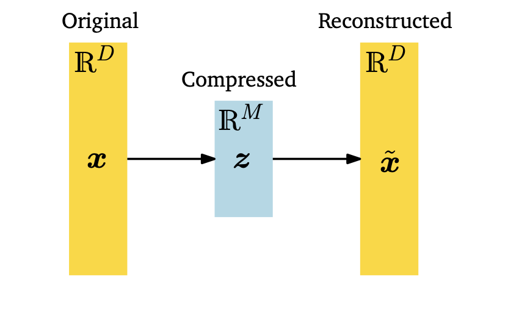

## Dimension Reduction Method

We work constantly with high dimensional data, and those often has some
properties tat we can exploit to reduce the dimensionality of the data.
For example high dimensional data is often overcomplete, meaning that
many dimensions are redundant and can be explained by a combination of
other dimensions. Futhemore, dimensions in high dimensional data are
often correlated, so that the data has a lower intrinsic dimensional
structure.\
\
We can define the dimension reduction as follows:\
Let $Z_1, Z_2, \dots, Z_M$ be $M < p$ linear combinations of the $p$
predictors. That is: $$Z_m = \sum_{j=1}^{p} \phi_{jm}X_j$$ where
$\phi_{1m}, \phi_{2m}, \dots, \phi_{pm}$ are the **loadings**, some
constants, of the linear combinations.\
\
We can then fit the usual linear regression model using the $M$
predictors $Z_1, Z_2, \dots, Z_M$:
$$Y = \theta_0 + \sum_{m=1}^{M} \theta_m Z_m + \epsilon_i , \quad \text{for } i = 1, 2, \dots, n$$\
\
We note that in linear regression models the regression coefficients are
given by $\theta_0, \theta_1, \cdots \theta_M$, and the loadings are
given by $\phi_{1m}, \phi_{2m}, \dots, \phi_{pm}$. If the loadings are
chosen wisely, then such dimension reduction approaches can often
outperform OLS (ordinary leastnsquares) regression. Note that:
$$\sum_{m=1}^{M} \theta_m Z_m = \sum_{m=1}^{M} \theta_m \sum_{j=1}^{p} \phi_{jm}X_j = \sum_{j=1}^{p} \left( \sum_{m=1}^{M} \theta_m \phi_{jm} \right)X_j = \sum_{j=1}^{p} \beta_j X_j$$
where: $$\beta_j = \sum_{m=1}^{M} \theta_m \phi_{jm}$$ Hence the
dimension reduction approach is equivalent to the OLS regression model
with $p$ predictors, where the predictors are the $p$ linear
combinations of the original predictors given by the loadings. Dimension
reduction serves to **constrain** the estimates of the coefficients
$\beta_j$ by constraining the estimates with the loadings $\phi_{jm}$.\
\
**Note:** Can win in the bias-variance tradeoff.

### Principal Components Regression {#sec:PCR}

A popular approach to dimension reduction is **Principal Components
Analysis** (PCA). Which is also a tool used for *unsupervised
learning*.\
In PCA, we are interested in finding projections $\tilde x_n$ of the
data points $x_n$ that are as similar to the orignal data points as
possible, but with a lower dimensionality.\
\
Concretely, we consider an i.i.d. dataset
$\cal{X}$$= \{x_1, \cdots, x_N\}$, where $x_n \in \mathbb R^D$, with
$\mu = 0$ and *data covarinace matrix $\Sigma$*:

$$\Sigma = \frac{1}{N} \sum_{n=1}^{N} x_n x_n^T$$

Furthermore, we assume there exists a low-dimensional compressed
representation of the predictors: $$z_n = B^T x_n$$ where
$z_n \in \mathbb R^M$ and $B \in \mathbb R^{D \times M}$ is a matrix of
*principal components*.\
We assume that the colums of $B$ are **orthonormal**[^2], i.e.
$B^T B = I$, where $I$ is the identity matrix. We seek a M-dimensional
subspace U of $\mathbb R^D$ such that the projection of the data onto U
maximizes the variance of the projected data.\
Our aim is to find projections $\tilde x_n \in \mathbb R^D$ (or
equivalently the codes $z_n$ and the basis vectors $b_1,...,b_M$)so that
they are as similar to the original data $x_n$ and minimize the loss due
to compression.

{width="40%"}

#### Maximum Variance Perspective

When we perform PCA we explicitly decide to ignore a 'cooordinate' of
the data beacaue it did not contain much information. We can interpret
the information content in the data as how much 'space filling' the
dataset is. We also remember (see [Appendix](sec:appendix)) that the
variance is an indicator of the spread of the data, and so we can derive
PCA as a dimensionality reduction algorithm that maximizes the variance
of the projected data, in the lower dimensional space, in order to
retain as much information as possible.\
\
Rehuarding the setting discussed before, our aim is to to find a matrix
B that retains as much information as possible when compressing data by
projecting it onto the subspace spanned by the $M$ columns of B.\
\
**Remark:** For **Centered Data**,$\mu = 0$, we can make, without loss
of generality, the assumption that:
$$\mathbb V_z[z] = \mathbb V_x[B^T(x - \mu)] = \mathbb V_x[B^Tx - B^T\mu] = \mathbb V_x[B^Tx]$$
With this assumption the mean of the low-dimensional code is also 0
since $\mathbb E[z] = \mathbb E[B^Tx] = B^T\mathbb E[x] = 0$. \
\

#### Direction with Maximal Variance

PCR identifies linear combinations, or directions, that best represent
the predictors. These directions are identified in an **unsupervised
way**, since the response Y is not used to help determine the principal
component directions. Consequently, PCR suffers from a potentially
serious drawback: there is no guarantee that the directions that best
explain the predictors will also be the best directions to use for
predicting the response

### Partial Least Squares

As PCR, PLS is a dimension reduction method, which first identitifies a
new set of features that are linear combinations of the original
features, but i a lower dimension, and then fits a linear model, via OLS
using these new M features. But, unlike PCR, PLS idinetifies the new
features in a **supervised way**, by exploiting the response variable Y
in order to indeintify new features that not only approximate the
original features well, but also *are related to the response*. Roughly
speaking, the PLS approach attempts to find directions that help explain
both the response and the predictors.\
\
How does it work?

-   Standardize the $p$ predictors.

-   PLS computes the first direction $Z_1$ by setting each $\phi_{j1}$
    to be equal to the coefficient $\theta$ from the simple linear
    regression of $Y$ onto $X_j$. This coefficient is proportional to
    the correlation between Y and$X_j$. Hence, in computing $Z_1$, PLS
    places the highest weight $\phi_1$ on the predictors that are most
    strongly related to the response.

-   Subsequent directions are found by taking residuals and then
    repeating the above prescription
